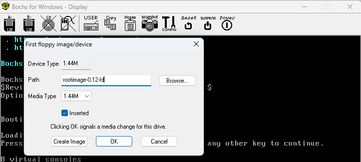

## 1.1 下载Linux 0.1x 系统软件包

设置好的 Linux 0.1x 系统， 我们从网站上下载一个如下 Linux 0.1x 系统软件包到桌面上：

http://oldlinux.org/Linux.old/bochs/linux-0.12-080324.zip

## 1.2 软件包解压，安装 bochs


## 1.3 使用 bochsrc-0.12-fd.bxrc 配置文件启动 Linux 0.12 系统

bochsrc-0.12-fd.bxrc 是 bochs 配置文件，每个配置文件都单独定义了运行时模拟的PC环境，文件内容如下：

```bxrc
# You many now use double quotes around pathnames, in case
# your pathname includes spaces.

#=======================================================================
# MEGS
#=======================================================================
megs: 16

#=======================================================================
# ROMIMAGE:
# The ROM BIOS controls what the PC does when it first powers on.
#=======================================================================
romimage: file=$BXSHARE/BIOS-bochs-latest 

#=======================================================================
# VGAROMIMAGE
# You now need to load a VGA ROM BIOS into C0000.
#=======================================================================
vgaromimage: file=$BXSHARE/VGABIOS-lgpl-latest

#=======================================================================
# FLOPPYA, FLOPPYB:
# Point this to pathname of floppy image file or device
#=======================================================================
floppya: 1_44="bootimage-0.12-fd", status=inserted
floppyb: 1_44=diska.img, status=inserted


#=======================================================================
# BOOT:
#=======================================================================
boot: a
#boot: c

#=======================================================================
# LOG:
# Give the path of the log file you'd like Bochs debug and misc. 
#=======================================================================
#log: /dev/null
log: bochsout.txt

#=======================================================================
# VGA_UPDATE_INTERVAL:
#=======================================================================
vga_update_interval: 300000
```
代码中配置说明：
* `megs`：PC机的物理内存
* `romimage`：模拟PC机的ROM BIOS（Read Only Memory）
* `vgaromimage`：模拟PC机的VGA显示卡ROM（Read Only Memory）程序
* `floppya`：指定模拟PC机的软盘驱动器A使用 1.44MB 盘类型。配置为 bootimage-0.12-fd ，处于插入状态
* `floppyb`：指定模拟PC机的软盘驱动器B使用 1.44MB 盘类型，配置为 diska.img，处于插入状态。
* `boot`：指定模拟PC机使用的启动的驱动器，这里设置由a盘启动
* `log`：日志输出的文件名

### 1.3.1 双击 bochsrc-0.12-fd.bxrc 启动 bochs，并更换软盘



