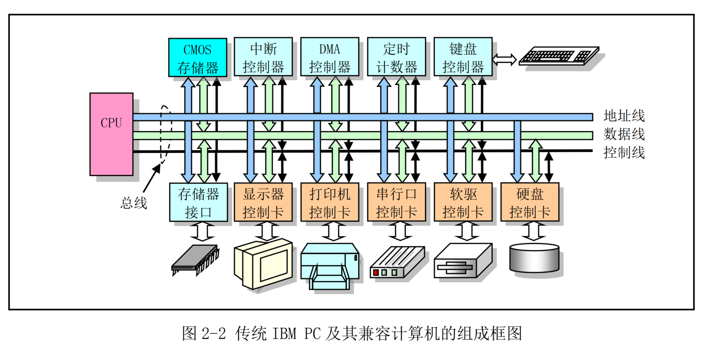
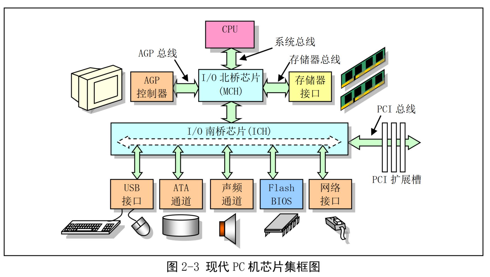
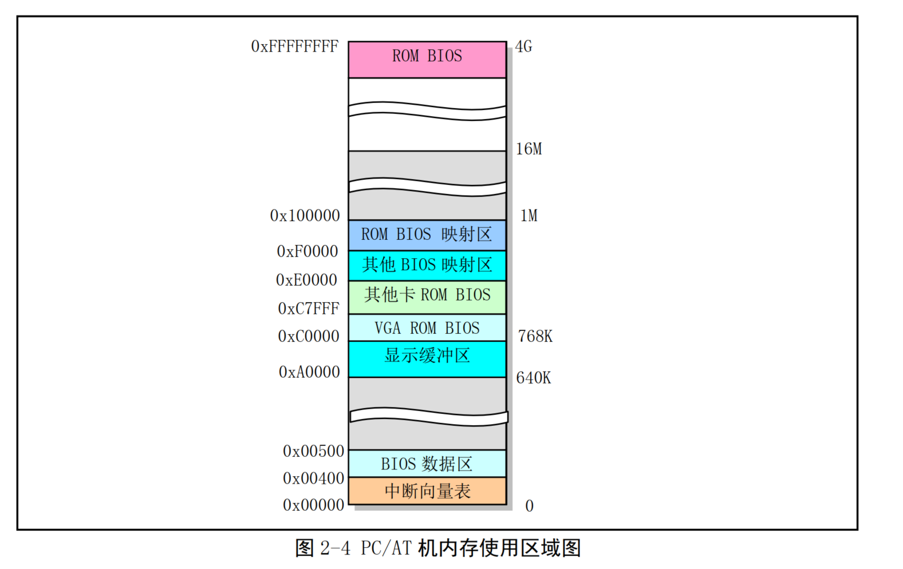
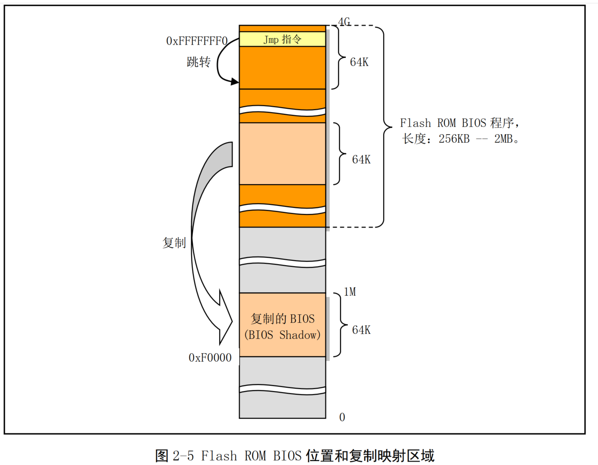

<!-- TOC -->
* [微型计算机组成结构](#微型计算机组成结构)
  * [2.1 微型计算机字组成原理](#21-微型计算机字组成原理)
    * [地址线，数据线、控制信号线](#地址线数据线控制信号线)
    * [总线插槽](#总线插槽)
    * [现代PC机芯片](#现代pc机芯片)
  * [2.2 I/O 端口寻址和访问方式](#22-io-端口寻址和访问方式)
    * [I/O 端口和寻址](#io-端口和寻址)
    * [2.2.2 接口访问控制](#222-接口访问控制)
      * [用程序循环查询方式](#用程序循环查询方式)
      * [中断处理方式](#中断处理方式)
      * [DMA传输方式](#dma传输方式)
  * [2.3 主存储、BIOS、CMOS存储器](#23-主存储bioscmos存储器)
    * [2.3.1 主存储器](#231-主存储器)
    * [2.3.2 基本输入/输出程序BIOS](#232-基本输入输出程序bios)
    * [2.3.3 CMOS 存储器](#233-cmos-存储器)
  * [2.4 控制器和控制卡](#24-控制器和控制卡)
<!-- TOC -->

# 微型计算机组成结构

## 2.1 微型计算机字组成原理

### 地址线，数据线、控制信号线
CPU 通过地址线，数据线、控制信号线组成的本地总线或称为内部总线，与系统的其他部分进行数据通信

* **地址线**：用于提供内存或I/O设备的地址，指明要读写数据的具体位置
* **数据线**：数据线用于在 CPU 和内存或 I/O 设备之间提供数据传输的通道
* **控制线**：负责指挥执行的具体读写操作




使用 80386 CPU的PC机器， 其内部地址线和数据线都分别为32根，即都是32位。因此地址寻址空间范 围有2^32次方，由0到4GB。

图中上部控制器和存储器接口通常都集成在计算机主板上，这些控制器分别都是以一块大规模集成电 路芯片为主组成的功能电路。例如，
中断控制器由 Intel 8259A 或其兼容芯片构成； 
DMA 控制器通常采用Intel 8237A 芯片构成；
定时计数器的核心则是 Intel 8253/8254 定时芯片；
键盘控制器使用的是 Intel 8042
芯片来与键盘中的扫描电路进行通信

### 总线插槽

总线插槽是系统地址总线、数据总线和控制线的与扩展设备控制器的标准连接接口。这些总线接口标准通常有工业标准结构。
* ISA（ Industry Standard Architecture）总线、
* 扩展工业标准结构总线 EISA（ Extented ISA）、
* 外围组件互连 PCI（ Peripheral Component Interconnect）总线、
* 加速图形端口 AGP（ Accelerated Graphics Port）视频总线等。

这些总线接口的主要区别在于数据传输速率和控制灵活性方面。随着计算机硬件的发展，传输速率更高、控制更灵活的总线接口还在不断推出，例如采用串行通信点对点技术的高速 PCIE（ PCI Express）总线

### 现代PC机芯片



随着计算机技术的发展，很多原来使用控制卡来完成的功能（例如硬盘控制器功能）都已经集成在计 算机主机板上少数几个超大规模集成电路芯片中，几个甚至是一个这样的芯片就确定了主机板的主要特性 和功能，并且为了让系统的不同部分都能达到其最高传输速率,总线结构也发生了很大变化。
除了 CPU 以外，现代 PC 机主板主要使用 2 个超大规模芯片构成的芯片组或芯片集（ Chipsets）组成：北桥（ Northbridge）芯片和南桥（ Southbridge）芯片.
* **北桥芯片**用于与 CPU、内存和 AGP 视频接口，这些接口具有很高的传输速率。北桥芯片还起着存储器控制作用，因此 Intel 把该芯片标号为 MCH（ Memory Controller Hub）芯片。
* **南桥芯片**用来管理低、中速的组件，例如， PCI 总线、 IDE 硬盘接口、 USB 端口等，因此南桥芯片的名称为 ICH（ I/O Controller Hub）

`PS：之所以称为南北桥，是因为他们分别位于主板的下端和上端，即地图上的南部和北部，并起着与CPU进行通道桥接的作用。`

## 2.2 I/O 端口寻址和访问方式

在 CPU 和 I/O 适配器之间开始传输数据时，首先需要确定适配器的 I/O 位置，即端口地址

### I/O 端口和寻址

通常一个 I/O 控制器包含访问数据的数据端口、输出命令的命令端口和访问控制器执行状态的状态端口。端口地址的设置方法一般有两种：统一编址和独立编址

* **统一编址**： 端口统一编址的原理是把 I/O 控制器中的端口地址归入存储器寻址地址空间范围内。因此这种编址方 式也成为存储器映像编址。 CPU 访问一个端口的操作与访问内存的操作一样，也使用访问内存的指令
* **独立编址**：端口独立编址的方法是把 I/O 控制器和控制卡的寻址空间单独作为一个独立的地址空间对待，称为 I/O 地址 空间。每个端口有一个 I/O 地址与之对应，并且使用专门的 I/O 指令来访问端口。


IBM PC 及其兼容微机主要使用独立编址方式，采用了一个独立的 I/O 地址空间对控制设备中的寄存 器进行寻址和访问。使用 ISA 总线结构的传统 PC 机其 I/O 地址空间范围是 0x000 -- 0x3FF，有 1024 个 I/O 端口地址可供使用。

I/O 端口地址分配表

| 端口地址范围 | 分配说明 |
|:--|:--|
| 0x000 -- 0x01F | 8237A DMA 控制器 1 |
| 0x020 -- 0x03F | 8259A 可编程中断控制器 1 |
| 0x040 -- 0x05F | 8253/8254A 定时计数器 |
| 0x060 -- 0x06F | 8042 键盘控制器 |
| 0x070 -- 0x07F | 访问 CMOS RAM/实时时钟 RTC（Real Time Clock）端口 |
| 0x080 -- 0x09F | DMA 页面寄存器访问端口 |
| 0x0A0 -- 0x0BF | 8259A 可编程中断控制器 2 |
| 0x0C0 -- 0x0DF | 8237A DMA 控制器 2 |
| 0x0F0 -- 0x0FF | 协处理器访问端口 |
| 0x170 -- 0x177 | IDE 硬盘控制器 1 |
| 0x1F0 -- 0x1F7 | IDE 硬盘控制器 0 |
| 0x278 -- 0x27F | 并行打印机端口 2 |
| 0x2F8 -- 0x2FF | 串行控制器 2 |
| 0x378 -- 0x37F | 并行打印机端口 1 |
| 0x3B0 -- 0x3BF | 单色 MDA 显示控制器 |
| 0x3C0 -- 0x3CF | 彩色 CGA 显示控制器 |
| 0x3D0 -- 0x3DF | 彩色 EGA/VGA 显示控制器 |
| 0x3F0 -- 0x3F7 | 软盘控制器 |
| 0x3F8 -- 0x3FF | 串行控制器 1 | 

在普通 Linux 系统下通过查看 /proc/ioports 文件可以得到相关控制器或设置使用的 I/O 地址范围.

```shell
ubuntu@ubuntu:~$ sudo su
root@ubuntu:/home/ubuntu# cat /proc/ioports
0000-0cf7 : PCI Bus 0000:00
  0000-001f : dma1
  0020-0021 : PNP0001:00
    0020-0021 : pic1
  0040-0043 : timer0
  0050-0053 : timer1
  0060-0060 : keyboard
  0061-0061 : PNP0800:00
  0064-0064 : keyboard
  0070-0071 : rtc0
  0080-008f : dma page reg
  00a0-00a1 : PNP0001:00
    00a0-00a1 : pic2
  00c0-00df : dma2
  00f0-00ff : fpu
  0170-0177 : 0000:00:07.1
    0170-0177 : ata_piix
  01f0-01f7 : 0000:00:07.1
    01f0-01f7 : ata_piix
  0376-0376 : 0000:00:07.1
    0376-0376 : ata_piix
  03c0-03df : vga+
  03f2-03f2 : floppy
  03f4-03f5 : floppy
  03f6-03f6 : 0000:00:07.1
    03f6-03f6 : ata_piix
  03f7-03f7 : floppy
  03f8-03ff : serial
  04d0-04d1 : PNP0001:00
  0cf0-0cf1 : pnp 00:00
0cf8-0cff : PCI conf1
0d00-feff : PCI Bus 0000:00
  1000-103f : 0000:00:07.3
    1000-103f : pnp 00:00
      1000-1003 : ACPI PM1a_EVT_BLK
      1004-1005 : ACPI PM1a_CNT_BLK
      1008-100b : ACPI PM_TMR
      100c-100f : ACPI GPE0_BLK
  1040-104f : 0000:00:07.3
    1040-104f : pnp 00:00
  1060-106f : 0000:00:07.1
    1060-106f : ata_piix
  1070-107f : 0000:00:0f.0
    1070-107f : vmwgfx probe
  1080-10bf : 0000:00:07.7
  1400-14ff : 0000:00:10.0
  2000-3fff : PCI Bus 0000:02
    2000-203f : 0000:02:01.0
      2000-203f : e1000
    2040-207f : 0000:02:02.0
      2040-207f : Ensoniq AudioPCI
    2080-209f : 0000:02:00.0
      2080-209f : uhci_hcd
  4000-4fff : PCI Bus 0000:03
  5000-5fff : PCI Bus 0000:0b
  6000-6fff : PCI Bus 0000:13
  7000-7fff : PCI Bus 0000:1b
  8000-8fff : PCI Bus 0000:04
  9000-9fff : PCI Bus 0000:0c
  a000-afff : PCI Bus 0000:14
  b000-bfff : PCI Bus 0000:1c
  c000-cfff : PCI Bus 0000:05
  d000-dfff : PCI Bus 0000:0d
  e000-efff : PCI Bus 0000:15
  fce0-fcff : pnp 00:07
```

### 2.2.2 接口访问控制

PC 机 I/O 接口数据传输控制方式一般可采用程序循环查询方式、中断处理方式和 DMA 传输方式

#### 用程序循环查询方式

循环查询方式是指 CPU 通过在程序中循环查询指定设备控制器中的状态来判断是否可以与设备
进行数据交换。这种方式不需要过多硬件支持，使用和编程都比较简单，但是特别耗费 CPU 宝贵时间。
因此在多任务操作系统中除非等待时间极短或必须，否则就不应该使用这种方式。在 Linux 操作系统中，
只有在设备或控制器能够立刻返回信息时才会在很少的几个地方采用这种方式

#### 中断处理方式

中断处理控制方式需要有中断控制器的支持。在这种控制方式下，只有当 I/O 设备通过中断向 CPU 提
出处理请求时， CPU 才会暂时中断当前执行的程序转而去执行相应的 I/O 中断处理服务过程。当执行完该
中断处理服务过程后， CPU 又会继续执行刚才被中断的程序。在 I/O 控制器或设备发出中断请求时， CPU
通过使用中断向量表（或中断描述符表）来寻址相应的中断处理服务过程的入口地址。因此采用中断控制
方式时需要首先设置好中断向量表，并编制好相应的中断处理服务过程。 Linux 操作系统中大多数设备 I/O
控制都采用中断处理方式。

#### DMA传输方式

直接存储器访问 DMA（ Direct Memory Access）方式用于 I/O 设备与系统内存之间进行批量数据传送，
整个操作过程需要使用专门的 DMA 控制器来进行而无需 CPU 插手。由于在传输过程中无须软件介入，因
此操作效率很高。在 Linux 操作系统中，软盘驱动程序使用中断和 DMA 方式配合来实现数据的传输工作

## 2.3 主存储、BIOS、CMOS存储器

典型PC机上存在三种类型存储器，一种用于运行程序呵呵临时保存数据的内存存储器，一种存储系统开机诊断和初始化硬件程序ROM，另一种是用来存放计算机事实时钟的系统硬件配置信息的少量CMOS存储器。

### 2.3.1 主存储器

**主存储器就是内存**

当计算机上电初始化时，物理内存被设置为由地址0开始的连续区域。除了地址从 0xA0000 到 0xFFFFF （ 640K 到 1M 共 384K）和 0xFFFE0000 到 0xFFFFFFFF（ 4G 处的最后一 64K）范围以外的所有内存都可
用作系统内存。这两个特定范围被用于 I/O 设备和 BIOS 程序。


假如我们的计算机中有 16MB 的物理内存， 那么在 Linux 0.1x 系统中， 
1. 0--640K 将被用作存放内核代码和数据。 Linux 内核不使用 BIOS 功能，也不使用 BIOS 设置的中断向量表。 
2. 640K-- 1M 之间的 384K 仍然保留用作图中指明的用途。其中地址 0xA0000 
   * 开始的 128K 用作显示内存缓冲区，随后部分用于其他控制卡的 ROM BIOS 或其映射区域，而 0xF0000 到 1M 范围用于高端系统 ROM BIOS 的映射区。 
4. 1M--16M 将被内核用于作为可分配的主内存区。另外高速缓冲区和内存虚拟盘也会占用内核代码和数据后面的一部分内存区域，该区域通常会跨越 640K -- 1M 的区域。




### 2.3.2 基本输入/输出程序BIOS

存放在 ROM 中的系统 BIOS 程序主要用于计算机开机时执行系统各部分的自检，建立起操作系统需要使用的各种配置表，例如中断向量表、硬盘参数表。并且把处理器和系统其余部分初始化到一个已知状态，而且还为 DOS 等操作系统提供硬件设备接口服务。但是由于 BIOS 提供的这些服务不具备可重入性（即 其中程序不可并发运行），并且从访问效率方面考虑，因此除了在初始化时会利用 BIOS 提供一些系统参数以外， Linux 操作系统在运行时并不使用 BIOS 中的功能

当计算机系统上电开机或者按了机箱上的复位按钮时，CPU会自动将代码段寄存器CS设置为0xF000，其段基地址则被设置为 0xFFFF0000，段长度设置为 64KB.而 IP 被设置为 0xFFF0，因此此时 CPU 代码指针指向 0xFFFFFFF0 处，即 4G 空间最后一个 64K 的最后 16 字节处。
由上图可知，这里正是系统 ROM BIOS存放的位置。并且 BIOS 会在这里存放一条跳转指令 JMP 跳转到 BIOS 代码中 64KB 范围内的某一条指令开始执行。

此后， BIOS 在执行了一些列硬件检测和初始化操作之后，就会把与原来 PC 机兼容的 64KB BIOS 代码和数据复制到内存低端 1M 末端的 64K 处，然后跳转到个地方并让 CPU 真正运行在实地址模式下，见图 2-5 所示。最后 BIOS 就会从硬盘或其他块设备把操作系统引导程序加载到内存 0x7c00 处，并跳转到这个地方继续执行引导程序



### 2.3.3 CMOS 存储器

在 PC/AT 机中，除需要使用内存和 ROM BIOS 以外，还使用只有很少存储容量的（只有 64 或 128 字节） CMOS（ Complementary Metal Oxide Semiconductor，互补金属氧化物半导体）存储器来存放计算机的实时时钟信息和系统硬件配置信息。这部分内存通常和实时时钟芯片（ Real Time Chip）做在一块集成块中。CMOS 内存的地址空间在基本内存地址空间之外，需要使用 I/O 指令来访问。

## 2.4 控制器和控制卡

**中断控制器**

**DMA控制器**

DMA 控制器的主要功能是通过让外部设备直接与内存传输数据来增强系统的性能。通常它由机器上的 Intel 8237 芯片或其兼容芯片实现。通过对 DMA 控制器进行编程， 外设与内存之间的数据传输能在不受 CPU 控制的条件下进行。因此在数据传输期间， CPU 可以做其他事情

**定时/计数器**

**键盘控制器**

**串行控制卡**

串行通信是指在线路上以比特位数据流一次一个比特进行传输的通信方式。串行通信可分为异步和同步串行通信两种类型。

**显示控制**

**软盘与硬盘控制器**