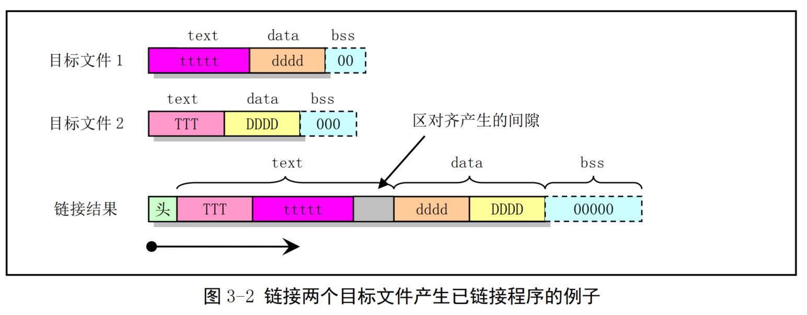
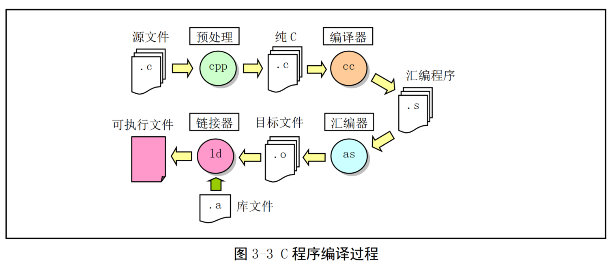
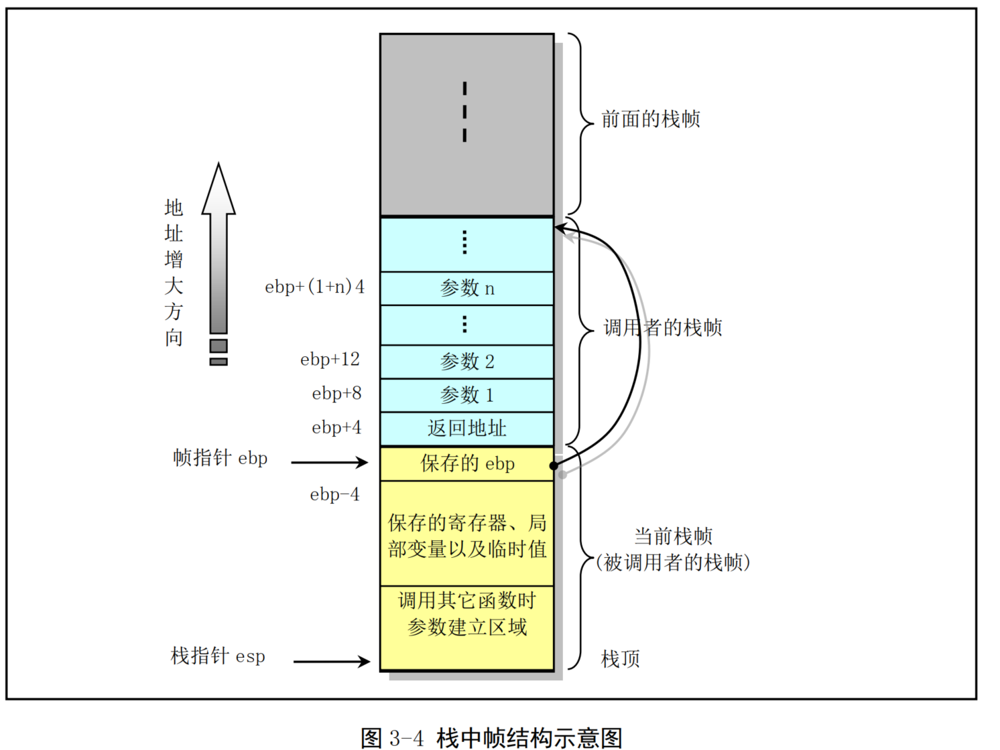
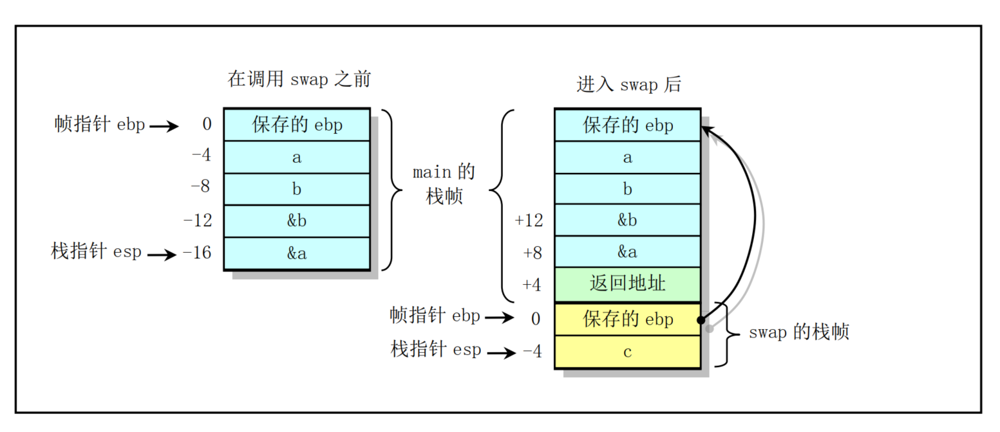
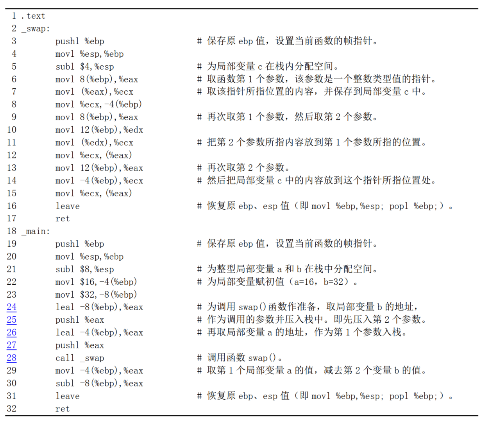
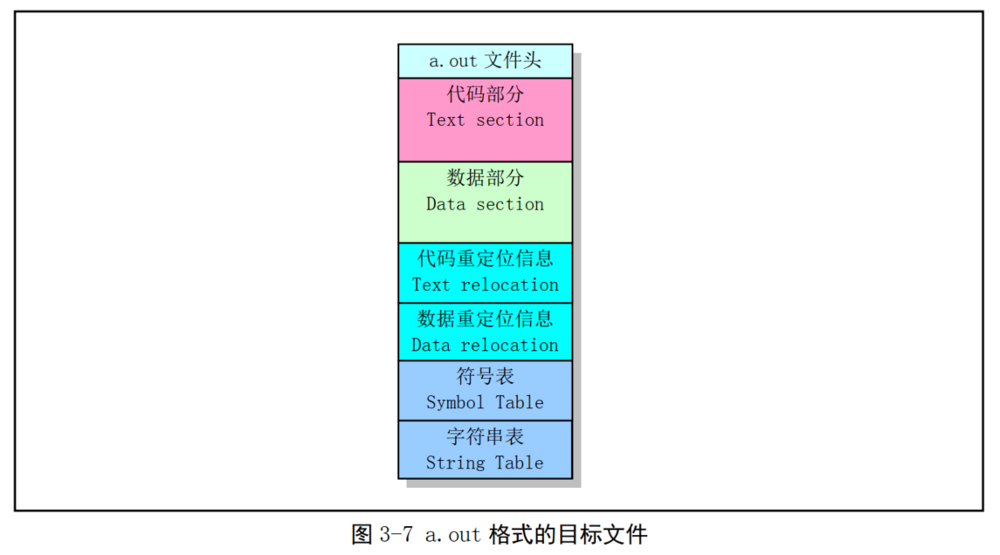
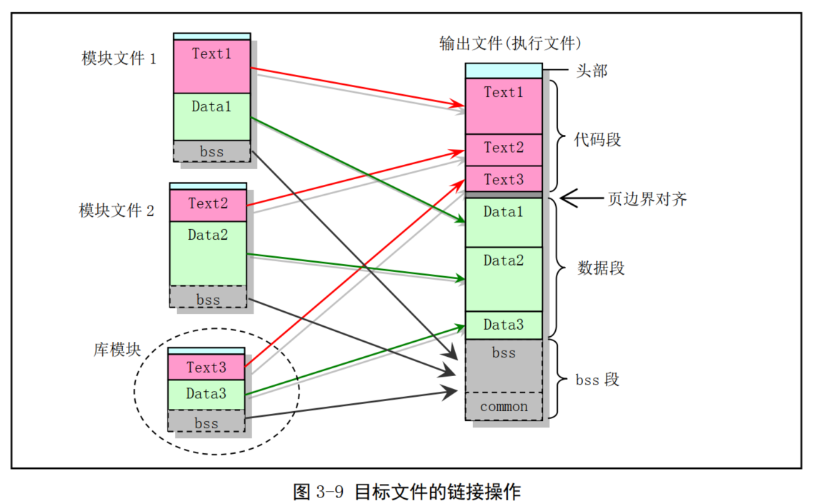

<!-- TOC -->
* [3.1 AS 86 汇编器](#31-as-86-汇编器)
  * [3.1.1 as86汇编语言语法](#311-as86汇编语言语法)
    * [3.1.2 as86 汇编语言程序](#312-as86-汇编语言程序)
    * [3.1.3 as86 汇编语言程序的编译和链接](#313-as86-汇编语言程序的编译和链接)
    * [3.1.4 as86 和 ld86 使用方法和选项](#314-as86-和-ld86-使用方法和选项)
      * [as86的使用方法和选项](#as86的使用方法和选项)
      * [ld86的使用方法和选项](#ld86的使用方法和选项)
  * [3.2 GNU as 汇编](#32-gnu-as-汇编)
    * [3.2.1 编译as汇编语言程序](#321-编译as汇编语言程序)
    * [3.2.2 as 汇编语法](#322-as-汇编语法)
      * [3.2.2.1  汇编语言预处理](#3221--汇编语言预处理)
      * [3.2.3 指令语句、操作数和寻址](#323-指令语句操作数和寻址)
      * [3.2.3.1 指令操作码的命名](#3231-指令操作码的命名)
      * [3.2.3.2 指令操作码前缀](#3232-指令操作码前缀)
      * [3.2.3.3 内存引用](#3233-内存引用)
      * [3.2.3.4 跳转指令](#3234-跳转指令)
    * [3.2.4 区与重定位](#324-区与重定位)
      * [3.2.4.1 链接器涉及的区](#3241-链接器涉及的区)
      * [3.2.4.2 子区](#3242-子区)
      * [3.2.4.3 bss 区](#3243-bss-区)
    * [3.2.6 as 汇编命令](#326-as-汇编命令)
      * [3.2.6.1 .align abs-expr1, abs-expr2, abs-expr3](#3261-align-abs-expr1-abs-expr2-abs-expr3)
      * [3.2.6.2 .ascii "string"...](#3262-ascii-string)
      * [3.2.6.3 .asciz "string"...](#3263-asciz-string)
      * [3.2.6.4 .byte expressions](#3264-byte-expressions)
      * [3.2.6.5 .comm symbol, length](#3265-comm-symbol-length)
      * [3.2.6.6 .data subsection](#3266-data-subsection)
      * [3.2.6.7 .desc symbol, abs-expr](#3267-desc-symbol-abs-expr)
      * [3.2.6.8 .fill repeat, size, value](#3268-fill-repeat-size-value)
      * [3.2.6.9 .global symbol （或者.globl symbol）](#3269-global-symbol-或者globl-symbol)
      * [3.2.6.10 .int expressions](#32610-int-expressions)
      * [3.2.6.11 .lcomm symbol, length](#32611-lcomm-symbol-length)
      * [3.2.6.12 .long expressions](#32612-long-expressions)
      * [3.2.6.13 .octa bignums](#32613-octa-bignums)
      * [3.2.6.14 .org new_lc, fill](#32614-org-newlc-fill)
      * [3.2.6.15 .quad bignums](#32615-quad-bignums)
      * [3.2.6.16 .short expressions （同.word expressions）](#32616-short-expressions-同word-expressions)
      * [3.2.6.17 .space size, fill](#32617-space-size-fill)
      * [3.2.6.18 .string "string"](#32618-string-string)
      * [3.2.6.19 .text subsection](#32619-text-subsection)
      * [3.2.6.20 .word expressions](#32620-word-expressions)
    * [3.2.7 编写16位代码](#327-编写16位代码)
    * [3.2.8 AS 汇编器命令行选项](#328-as-汇编器命令行选项)
  * [3.3 C语言程序](#33-c语言程序)
    * [3.3.1 C程序的编译和链接](#331-c程序的编译和链接)
    * [3.3.2 嵌入汇编](#332-嵌入汇编)
    * [3.3.3 圆括号中的组合语句](#333-圆括号中的组合语句)
    * [3.3.4 寄存器变量](#334-寄存器变量)
    * [3.3.5 内联函数](#335-内联函数)
  * [3.4 C 与 汇编语言相互调用](#34-c-与-汇编语言相互调用)
    * [3.4.1 C 函数调用机制](#341-c-函数调用机制)
      * [3.4.1.1 栈帧结构和控制转移权方式](#3411-栈帧结构和控制转移权方式)
      * [3.4.1.2 函数调用举例](#3412-函数调用举例)
      * [3.4.1.3 main()也是一个函数](#3413-main也是一个函数)
  * [3.5 Linux 0.12 目标文件格式](#35-linux-012-目标文件格式)
    * [3.5.1 目标文件格式](#351-目标文件格式)
      * [3.5.1.1 执行头部分](#3511-执行头部分)
      * [2.5.1.2 重定位信息部分](#2512-重定位信息部分)
      * [3.5.1.3 符号表和字符串部分](#3513-符号表和字符串部分)
    * [3.5.3 链接程序输出](#353-链接程序输出)
    * [3.5.4 链接程序预定义变量](#354-链接程序预定义变量)
    * [3.5.5 System.map 文件](#355-systemmap-文件)
<!-- TOC -->

# 3.1 AS 86 汇编器

Linux 1.x 使用了两种汇编器 Assembler

* 产生16位代码的as86汇编器，使用配套的ld86链接器
* GNU汇编器gas（as），使用GNU ld链接器来产生目标文件

## 3.1.1 as86汇编语言语法

_Linux 系统仅使用 as86 和 ld86 编译和链接上面提到的两个 16 位汇编程序 bootsect.s 和 setup.s_

```
as [选项] -o objfile srcfile
```

汇编器编译产生的目标文件 objfile 通常起码包含三个段或区（ section），即正文段（ .text）、数据段（ .data）和未初始化数据段（ .bss）。

正文段（或称为代码段）是一个已初始化过的段，通常其中包含程序的执行代码和只读数据。
数据段也是一个已初始化过的段，其中包含有可读/写的数据。
而未初始化数据段是一个未初始化的段。通常汇编器产生的输出目标文件中不会为该段保留空间，但在目标文件链接成执行程序被加载时操作系统会把该段的内容全部初始化为 0。

在编译过程中，汇编语言程序中会产生代码或数据的语句，都会在这三个中的一个段中生成代码或数据。编译产生的字节会从'.text'段开始存放。

```text
! 直接寄存器寻址。跳转到 bx 值指定的地址处，即把 bx 的值拷贝到 IP 中。
mov bx,ax
jmp bx
! 间接寄存器寻址。 bx 值指定内存位置处的内容作为跳转的地址。
mov [bx],ax
jmp [bx]
! 把立即数 1234 放到 ax 中。把 msg1 地址值放到 ax 中。
mov ax,#1234
mov ax,#msg1
! 绝对寻址。把内存地址 1234（ msg1） 处的内容放入 ax 中。
mov ax,1234
mov ax,msg1
mov ax,[msg1]
! 索引寻址。把第 2 个操作数所指内存位置处的值放入 ax 中。
mov ax,msg1[bx]
mov ax,mgs1[bx*4+si]
```

### 3.1.2 as86 汇编语言程序

```text
1 !
2 ! boot.s -- bootsect.s 的框架程序。用代码 0x07 替换串 msg1 中 1 字符，然后在屏幕第 1 行上显示。
3 !
4 .globl begtext, begdata, begbss, endtext, enddata, endbss ! 全局标识符，供 ld86 链接使用；
5 .text ! 正文段；
6 begtext:
7 .data ! 数据段；
8 begdata:
9 .bss ! 未初始化数据段；
10 begbss:
11 .text ! 正文段；
12 BOOTSEG = 0x07c0 ! BIOS 加载 bootsect 代码的原始段地址；
13
14 entry start ! 告知链接程序，程序从 start 标号处开始执行。
15 start:
16 jmpi go,BOOTSEG ! 段间跳转。 INITSEG 指出跳转段地址， 标号 go 是偏移地址。
17 go: mov ax,cs ! 段寄存器 cs 值-->ax，用于初始化数据段寄存器 ds 和 es。
18 mov ds,ax
19 mov es,ax
20 mov [msg1+17],ah ! 0x07-->替换字符串中 1 个点符号，喇叭将会鸣一声。
21 mov cx,#20 ! 共显示 20 个字符，包括回车换行符。
22 mov dx,#0x1004 ! 字符串将显示在屏幕第 17 行、第 5 列处。
23 mov bx,#0x000c ! 字符显示属性（红色）。
24 mov bp,#msg1 ! 指向要显示的字符串（中断调用要求）。
25 mov ax,#0x1301 ! 写字符串并移动光标到串结尾处。
26 int 0x10 ! BIOS 中断调用 0x10，功能 0x13，子功能 01。
27 loop1: jmp loop1 ! 死循环。
28 msg1: .ascii "Loading system ..."! 调用 BIOS 中断显示的信息。共 20 个 ASCII 码字符。
29 .byte 13,10
30 .org 510 ! 表示以后语句从地址 510(0x1FE)开始存放。
31 .word 0xAA55 ! 有效引导扇区标志， 供 BIOS 加载引导扇区使用。
32 .text
33 endtext:
34 .data
35 enddata:
36 .bss
37 endbss:
```

作用：
该程序是一个简单的引导扇区启动程序。 编译链接产生的执行程序可以放入软盘第 1 个扇区直接用来引导计算机启动。启动后会在屏幕第 17 行、 第 5 列处显示出红色字符串"Loading system .."，并且光标下移一行。然后程序就在第 27 行上死循环

* 注释文字 `!` `;`
* `.globl` 是汇编指示符（或称为汇编伪指令、伪操作符）。汇编指示符均以一个字符`.`开始，并且不会在编译时产生任何代码.
  * 汇编指示符由一个伪操作码，后跟 0 个或多个操作数组成。例如第 4 行上的'globl'是一个伪操作码，而其后面的标号 'begtext, begdata, begbss' 等标号就是它的操作数
* 第 5 行到第 11 行上除定义了 3 个标号外，还定义了 3 个伪操作符： '.text'、 '.data'、 '.bbs'。它们分别对应汇编程序编译产生目标文件中的 3 个段，即正文段、数据段和未初始化数据段。
  * '.text'用于标识正文段的开始位置，并把切换到 text 段；
  * '.data'用于标识数据段的开始位置，并把当前段切换到 data段；
  * 而'.bbs'则用于标识一个未初始化数据段的开始，并把当前段改变成 bbs 段。
  * 因此行 5--11 用于在每个段中定义一个标号，最后再切换到 text 段开始编写随后的代码。 这里把三个段都定义在同一重叠地址 范围中，因此本示例程序实际上不分段
* 标识符'entry'是保留关键字，用于迫使链接器 ld86 在生成的可执行文件中包括进其后指定的标号'start'。通常在链接多个目标文件生成一个可执行文件时应该在其中一个汇编程序中用关键词 entry 指定一个入口标号，以便于调试。

### 3.1.3 as86 汇编语言程序的编译和链接

```text

```

### 3.1.4 as86 和 ld86 使用方法和选项

#### as86的使用方法和选项

```text
as [-03agjuw] [-b [bin]] [-lm [list]] [-n name] [-o objfile] [-s sym] srcfile

默认设置 (除了以下默认值以外，其他选项默认为关闭或无；若没有明确说明 a 标志，则不会有输出):
-3 使用 80386 的 32 位输出；
list 在标准输出上显示；
name 源文件的基本名称（即不包括'.'后的扩展名）；
各选项含义：
-0 使用 16 比特代码段；
-3 使用 32 比特代码段；
-a 开启与 GNU as、 ld 的部分兼容性选项；
-b 产生二进制文件，后面可以跟文件名；
-g 在目标文件中仅存入全局符号；
-j 使所有跳转语句均为长跳转；
-l 产生列表文件，后面可以跟随列表文件名；
-m 在列表中扩展宏定义；
-n 后面跟随模块名称（取代源文件名称放入目标文件中） ；
-o 产生目标文件，后跟目标文件名（ objfile） ；
-s 产生符号文件，后跟符号文件名；
-u 将未定义符号作为输入的未指定段的符号；
-w 不显示警告信息；
```

#### ld86的使用方法和选项

```text
对于生成 Minix a.out 格式的版本：
ld [-03Mims[-]] [-T textaddr] [-llib_extension] [-o outfile] infile...
对于生成 GNU-Minix 的 a.out 格式的版本：
ld [-03Mimrs[-]] [-T textaddr] [-llib_extension] [-o outfile] infile...
默认设置(除了以下默认值以外，其他选项默认为关闭或无):
-03 32 位输出；
outfile a.out 格式输出；
-0 产生具有 16 比特魔数的头结构，并且对-lx 选项使用 i86 子目录；
-3 产生具有 32 比特魔数的头结构，并且对-lx 选项使用 i386 子目录；
-M 在标准输出设备上显示已链接的符号；
-T 后面跟随正文基地址 (使用适合于 strtoul 的格式)；
-i 分离的指令与数据段（ I&D）输出；
-lx 将库/local/lib/subdir/libx.a 加入链接的文件列表中；
-m 在标准输出设备上显示已链接的模块；
-o 指定输出文件名，后跟输出文件名；
-r 产生适合于进一步重定位的输出；
-s 在目标文件中删除所有符号。
```

## 3.2 GNU as 汇编

### 3.2.1 编译as汇编语言程序

```shell
as [ 选项 ] [ -o objfile ] [ srcfile.s ...]
```

### 3.2.2 as 汇编语法

1. AT&T 语法中立即操作数前面要加一个字符'$'；寄存器操作数名前要加字符百分号'%'；绝对跳转/调用（相对于与程序计数器有关的跳转/调用）操作数前面要加星号'*'。而 Intel 汇编语法均没有这些限制
2. AT&T 语法与 Intel 语法使用的源和目的操作数次序正好相反。 AT&T 的源和目的操作数是从左到右 '源, 目的'。例如 Intel 的语句 'add eax, 4' 对应 AT&T 的 'addl $4, %eax'
3. AT&T 语法中内存操作数的长度（宽度）由操作码最后一个字符来确定。操作码后缀'b'、 'w'和'l'分别指示内存引用宽度为 8 位字节（ byte）、 16 位字（ word）和 32 位长字（ long）。 Intel 语法则通过在内存操作数前使用前缀'byte prt'、 'word ptr'和'dword ptr'来达到同样目的。因此Intel 的语句'mov al, byte ptr foo'对应于 AT&T 的语句'movb $foo, %al'。
4. AT&T 语法中立即形式的远跳转和远调用为'ljmp/lcall $section, $offset'，而 Intel 的是'jmp/call far section:offset'。同样， AT&T 语法中远返回指令'lret $stack-adjust'对应 Intel 的'ret far stack-adjust'
5. AT&T 汇编器不提供对多代码段程序的支持， UNIX 类操作系统要求所有代码在一个段中。

#### 3.2.2.1  汇编语言预处理
s 汇编器具有对汇编语言程序内置的简单预处理功能。该预处理功能会调整并删除多余的空格字符和制表符；删除所有注释语句并且使用单个空格或一些换行符替换它们；把字符常数转换成对应的数值。但是该预处理功能不会对宏定义进行处理，也没有处理包含文件的功能。如果需要这方面的功能，那么可以让汇编语言程序使用大写的后缀 '.S' 让 as 使用 gcc 的 CPP 预处理功能

#### 3.2.3 指令语句、操作数和寻址

指令（ Instructions） 是 CPU 执行的操作，通常指令也称作操作码（ Opcode）；操作数（ Operand） 是 指令操作的对象；而地址（ Address） 是指定数据在内存中的位置。指令语句是程序运行时刻执行的一条语句，它通常可包含 4 个组成部分：
* 标号（ 可选）；
* 操作码（指令助记符）；
* 操作数（由具体指令指定）；
* 注释

操作数可以是立即数（即值是常数值的表达式）、寄存器（值在 CPU 的寄存器中）或内存（值在内存中）。

#### 3.2.3.1 指令操作码的命名

AT&T 语法中指令操作码名称（即指令助记符）最后一个字符用来指明操作数的宽度。字符'b'、 'w' 和'l'分别指定 byte、 word 和 long 类型的操作数。如果指令名称没有带这样的字符后缀，并且指令语句中不含内存操作数，那么 as 就会根据目的寄存器操作数来尝试确定操作数宽度。
例如指令语句'mov %ax, %bx'等同于'movw %ax, %bx'

AT&T 语法中符号扩展和零扩展的基本操作码名称分别是'movs...'和'movz...'， Intel 中分别是'movsx'和'movzx'。两个后缀就附在操作码基本名上。例如“使用符号扩展从%al 移动到%edx”的 AT&T 语句是'movsbl %al, %edx'，即从 byte 到 long 是 bl、从 byte 到 word 是 bw、从 word 到 long 是 wl

AT&T 语法与 Intel 语法中转换指令的对应关系

| AT&T | Intel | 说明                     |
|:-----|:------|:-----------------------|
| cbtw | cbw   | 把%al 中的字节值符号扩展到%ax 中   |
| cwtl | cwde  | 把%ax 符号扩展到%eax 中       |
| cwtd | cwd   | 把%ax 符号扩展到%dx:%ax 中    |
| cltd | cdq   | 把%eax 符号扩展到%edx:%eax 中 |


#### 3.2.3.2 指令操作码前缀

操作码前缀用于修饰随后的操作码。它们用于重复字符串指令、提供区覆盖、执行总线锁定操作、或指定操作数和地址宽度。

| 操作码前缀 | 说明                                                |
|:--|:--------------------------------------------------|
|  cs, ds, ss, es, fs, gs| 区覆盖操作码前缀。通过指定使用 区:内存操作数 内存引用形式会自动添加这种前缀。          |
| data16, addr16| 操作数/地址宽度前缀。这两个前缀会把 32 位操作数/地址改变成16 位的操作数/地址。但请注意， as 并不支持 16 位寻址方式。|
| lock| 总线锁存前缀。用于在指令执行期间禁止中断（仅对某些指令有效， 请参见 80X86 手册）。     |
| wait| 协处理器指令前缀。等待协处理器完成当前指令的执行。对于80386/80387 组合用不着这个前缀。 |
| rep, repe, repne | 串指令操作前缀，使串指令重复执行%ecx 中指定的次数。                      |

#### 3.2.3.3 内存引用

Intel 语法的间接内存引用形式： `section:[base + index*scale + disp]`

对应于如下 AT&T 语法形式： `section:disp(base, index, scale)`

```shell
movl var, %eax # 把内存地址 var 处的内容放入寄存器%eax 中。
movl %cs:var, %eax # 把代码段中内存地址 var 处的内容放入%eax 中。
movb $0x0a,%es:(%ebx) # 把字节值 0x0a 保存到 es 段的%ebx 指定的偏移处。
movl $var, %eax # 把 var 的地址放入%eax 中。
movl array(%esi), %eax # 把 array+%esi 确定的内存地址处的内容放入%eax 中。
movl (%ebx, %esi, 4), %eax # 把%ebx+%esi*4 确定的内存地址处的内容放入%eax 中。
movl array(%ebx, %esi, 4), %eax # 把 array + %ebx+%esi*4 确定的内存地址处的内容放入%eax 中。
movl -4(%ebp), %eax # 把 %ebp -4 内存地址处的内容放入%eax 中，使用默认段%ss。
movl foo(,%eax,4), %eax # 把内存地址 foo + eax * 4 处内容放入%eax 中，使用默认段%ds。
```

#### 3.2.3.4 跳转指令

跳转指令用于把执行点转移到程序另一个位置处继续执行下去。这些跳转的目的位置通常使用一个标号来表示。在生成目标代码文件时，汇编器会确定所有带有标号的指令的地址，并且把跳转到的指令的地址编码到跳转指令中。

跳转指令可分为无条件跳转和条件跳转两大类。条件跳转指令将依赖于执行指令时标志寄存器中某个相关标志的状态来确定是否进行跳转，而无条件跳转则不依赖于这些标志。

JMP 是无条件跳转指令，并可分为直接（ direct）跳转和间接（ indirect）跳转两类，而条件跳转指令只有直接跳转的形式。

对于直接跳转指令，跳转到的目标指令的地址是作为跳转指令的一部份直接编码 进跳转指令中；

对于间接跳转指令，跳转的目的位置取自于某个寄存器或某个内存位置中。

直接跳转语句的写法是给出跳转目标处的标号；间接跳转语句的写法是必须使用一个星字符'*'作为操作指示符的前缀字符，并且该操作指示符使用 movl 指令相同的语法。

```shell
jmp NewLoc # 直接跳转。无条件直接跳转到标号 NewLoc 处继续执行。
jmp *%eax # 间接跳转。寄存器%eax 的值是跳转的目标位置。
jmp *(%eax) # 间接跳转。从%eax 指明的地址处读取跳转的目标位置。
```

### 3.2.4 区与重定位

区（ Section）（也称为段、节或部分）用于表示一个地址范围，操作系统将会以相同的方式对待和处理在该地址范围中的数据信息。

链接器 ld 会把输入的目标文件中的内容按照一定规律组合生成一个可执行程序。当 as 汇编器输出一个目标文件时，该目标文件中的代码被默认设置成从地址 0 开始。此后 ld 将会在链接过程中为不同目标文件中的各个部分分配不同的最终地址位置。 

ld 会把程序中的字节块移动到程序运行时的地址处。这些块是作为固定单元进行移动的。它们的长度以及字节次序都不会被改变。这样的固定单元就被称作是区（或段、部分）。

而为区分配运行时刻的地址的操作就被称为重定位（ Relocation） 操作，其中包括调整目标文件中记录的地址，从而让它们对应到恰当的运行时刻地址上。

as 汇编器输出产生的目标文件中至少具有３个区，分别被称为正文（ text）、数据（ data） 和 bss 区。每个区都可能是空的。

#### 3.2.4.1 链接器涉及的区

* **text 区、 data 区** -- 这两个区用于保存程序。 as 和 ld 会分别独立而同等地对待它们。对其中 text 区的描述也同样适合于 data 区。然而当程序在运行时，则通常 text 区是不会改变的。 text 区通常会被进程共享，其中含有指令代码和常数等内容。程序运行时 data 区的内容通常是会变化的，例如， C 变量一般就存放在 data 区中。
* **bss 区** -- 在程序开始运行时这个区中含有 0 值字节。该区用于存放未初始化的变量或作为公共变量存储空间。虽然程序每个目标文件 bss 区的长度信息很重要，但是由于该区中存放的是 0 值字节，因此无须在目标文件中保存 bss 区。设置 bss 区的目的就是为了从目标文件中明确地排除0 值字节。
* **absolute 区** -- 该区的地址 0 总是“重定位”到运行时刻地址 0 处。如果你不想让 ld 在重定位作时改变你所引用的地址，那么就使用这个区。从这种观点来看，我们可以把绝对地址称作是“不可重定位的”：在重定位操作期间它们不会改变。
*  **undefined 区** -- 对不在先前所述各个区中对象的地址引用都属于本区。



#### 3.2.4.2 子区

使用子区是可选的。汇编取得的字节数据通常位于 text 或 data 区中。有时候在汇编源程序某个区中可能分布着一些不相邻的数据组，但是你可以会想让它们在汇编后聚集在一起存放。 
as 汇编器允许你利用子区（ subsection）来达到这个目的。在每个区中，可以有编号为 0--8192 的子区存在。编制在同一个子区中的对象会在目标文件中与该子区中其他对象放在一起。
例如，编译器可能想把常数存放在 text 区中，但是不想让这些常数散布在被汇编的整个程序中。在这种情况下，编译器就可以在每个会输出的代码区之前使用'.text 0'子区，并且在每组会输出的常数之前使用'.text 1'子区。

#### 3.2.4.3 bss 区

bss 区用于存储局部公共变量。你可以在 bss 区中分配空间，但是在程序运行之前不能在其中放置数据。因为当程序刚开始执行时， bss 区中所有字节内容都将被清零。 
'.lcomm'汇编命令用于在 bss 区中定义一个符号； '.comm'可用于在 bss 区中声明一个公共符号

### 3.2.6 as 汇编命令

#### 3.2.6.1 .align abs-expr1, abs-expr2, abs-expr3

.align 是存储对齐汇编命令，用于在当前子区中把位置计数器值设置（增加）到下一个指定存储边界处。

* 第 1 个绝对值表达式 abs-expr1（ absolute expression） 指定要求的边界对齐值。对于使用 a.out 格式目标文件的 80X86 系统，该表达式值是位置计数器值增加后其二进制值最右面 0 值位的个数，即是 2 的次方值。例如， '.align 3'表示把位置计数器值增加到 8 的倍数上。
* 第 2 个表达式给出用于对齐而填充的字节值。若省略，则填充字节值是 0。若想省略第 2 个参数，可以在第 1 和第 3 个参数之间使用两个逗号
* 第 3 个可选表达式 abs-expr3 用于指示对齐操作允许填充跳过的最大字节数。如果对齐操作要求跳过的字节数大于这个最大值，那么该对齐操作就被取消。

#### 3.2.6.2 .ascii "string"...

从位置计数器所值当前位置为字符串分配空间并存储字符串。可使用逗号分开写出多个字符串。例如，`.ascii "Hellow world!", "My assembler"`。该汇编命令会让 as 把这些字符串汇编在连续的地址位置处，每个字符串后面不会自动添加 0（ NULL）字节

#### 3.2.6.3 .asciz "string"...

该汇编命令与'.ascii'类似，但是每个字符串后面会自动添加 NULL 字符。

#### 3.2.6.4 .byte expressions

该汇编命令定义 0 个或多个用逗号分开的字节值。每个表达式的值是一个字节。

#### 3.2.6.5 .comm symbol, length

在 bss 区中声明一个命名的公共区域。
在 ld 链接过程中，某个目标文件中的一个公共符号会与其他目标文件中同名的公共符号合并。
如果 ld 没有找到一个符号的定义，而只是一个或多个公共符号，那么ld 就会分配指定长度 length 字节的未初始化内存。 length 必须是一个绝对值表达式，
如果 ld 找到多个长度不同但同名的公共符号， ld 就会分配长度最大的空间。

#### 3.2.6.6 .data subsection

该汇编命令通知 as 把随后的语句汇编到编号为 subsection 的 data 子区中。如果省略编号，则默认使用编号 0。编号必须是绝对值表达式。

#### 3.2.6.7 .desc symbol, abs-expr

用绝对表达式的值设置符号 symbol 的描述符字段 n_desc 的 16 位值。仅用于 a.out 格式的目标文件。 参见有关 include/a.out.h 文件的说明。

#### 3.2.6.8 .fill repeat, size, value

该汇编命令会产生数个（ repeat 个）大小为 size 字节的重复拷贝。大小值 size 可以为 0 或某个值，
但是若 size 大于 8，则限定为 8。每个重复字节内容取自一个 8 字节数。高 4 字节为 0，低 4 字节是数值value。这 3 个参数值都是绝对值， size 和 value 是可选的。
如果第 2 个逗号和 value 省略， value 默认为 0 值；如果后两个参数都省略的话，则 size 默认为 1。

#### 3.2.6.9 .global symbol （或者.globl symbol）

该汇编命令会使得链接器 ld 能看见符号 symbol。
如果在我们的目标文件中定义了符号 symbol，那么它的值将能被链接过程中的其他目标文件使用。若目标文件中没有定义该符号，那么它的属性将从链接过程中其他目标文件的同名符号中获得。
这是通过设置符号 symbol 类型字段中的外部位 N_EXT 来做到的。参见 include/a.out.h 文件中的说明

#### 3.2.6.10 .int expressions

该汇编命令在某个区中设置 0 个或多个整数值（ 80386 系统为 4 字节，同.long）。 每个用逗号分开的表达式的值就是运行时刻的值。例如.int 1234, 567, 0x89AB。

#### 3.2.6.11 .lcomm symbol, length

为符号 symbol 指定的局部公共区域保留长度为 length 字节的空间。所在的区和符号 symbol 的值是新的局部公共块的值。分配的地址在 bss 区中，因此在运行时刻这些字节值被清零。
由于符号 symbol 没有被声明为全局的，因此链接器 ld 看不见

#### 3.2.6.12 .long expressions

含义与.int 相同。

#### 3.2.6.13 .octa bignums

这个汇编命令指定 0 个或多个用逗号分开的 16 字节大数（ .byte, .word, .long, .quad, .octa 分别对应 1、 2、 4、 8 和 16 字节数）

#### 3.2.6.14 .org new_lc, fill

这个汇编命令会把当前区的位置计数器设置为值 new_lc。 new_lc 是一个绝对值（表达式），或者是具有相同区作为子区的表达式，也即不能使用.org 跨越各区。
如果 new_lc 的区不对，那么.org 就不会起作用。请注意，位置计数器是基于区的，即以每个区作为计数起点。

当位置计数器值增长时，所跳跃过的字节将被填入值 fill。该值必须是绝对值。如果省略了逗号和fill，则 fill 默认为 0 值。

#### 3.2.6.15 .quad bignums

这个汇编命令指定 0 个或多个用逗号分开的 8 字节大数 bignum。如果大数放不进 8 个字节中，则取低 8 个字节。

#### 3.2.6.16 .short expressions （同.word expressions）

这个汇编命令指定某个区中 0 个或多个用逗号分开的 2 字节数。对于每个表达式，在运行时刻都会产生一个 16 位的值

#### 3.2.6.17 .space size, fill

该汇编命令产生 size 个字节，每个字节填值 fill。这个参数均为绝对值。如果省略了逗号和 fill， 那么 fill 的默认值就是 0。

#### 3.2.6.18 .string "string"

定义一个或多个用逗号分开的字符串。在字符串中可以使用转义字符。每个字符串都自动附加一个 NULL 字符结尾。例如， .string "\n\nStarting", "other strings"

#### 3.2.6.19 .text subsection

通知 as 把随后的语句汇编进编号为 subsection 的子区中。如果省略了编号 subsection，则使用默认编号值 0

#### 3.2.6.20 .word expressions

对于 32 位机器，该汇编命令含义与.short 相同。

### 3.2.7 编写16位代码

虽然 as 通常用来编写纯 32 位的 80X86 代码，但是 1995 年后它对编写运行于实模式或 16 位保护模式的代码也提供有限的支持。
为了让 as 汇编时产生 16 位代码，需要在运行于 16 位模式的指令语句之前添 加汇编命令'.code16'，并且使用汇编命令'.code32'让 as 汇编器切换回 32 位代码汇编方式。

如果使用汇编命令'.code16'让 as 处于 16 位模式下，那么 as 会自动为所有指令加上一个必要的操作数宽度前缀而让指令运行在 16 位模式。
请注意，因为 as 为所有指令添加了额外的地址和操作数宽度前缀，所以汇编产生的代码长度和性能上将会受到影响

由于在 1991 年开发 Linux 内核 0.12 时 as 汇编器还不支持 16 位代码，因此在编写和汇编 0.12 内核实模式下的引导启动代码和初始化汇编程序时使用了前面介绍的 as86 汇编器。

### 3.2.8 AS 汇编器命令行选项

* -a 开启程序列表
* -f 快速操作
* -o 指定输出的目标文件名
* -R 组合数据区和代码区
* -W 取消警告信息

## 3.3 C语言程序

### 3.3.1 C程序的编译和链接

使用 gcc 汇编器编译 C 语言程序时通常会经过四个处理阶段，即预处理阶段、编译阶段、汇编阶段和链接阶段



* 在前处理阶段中， gcc 会把 C 程序传递给 C 前处理器 CPP，对 C 语言程序中指示符和宏进行替换处理，输出纯 C 语言代码；
* 在编译阶段， gcc 把 C 语言程序编译生成对应的与机器相关的 as 汇编语言代码；
* 在汇编阶段， as 汇编器会把汇编代码转换成机器指令，并以特定二进制格式输出保存在目标文件中；
* 最后 GNU ld 链接器把程序的相关目标文件组合链接在一起，生成程序的可执行映像文件。

调用 gcc 的命令行格式与编译汇编语言的格式类似：

```shell
gcc [ 选项 ] [ -o outfile ] infile ...
```
infile 是输入的 C 语言文件； 
outfile 是编译产生的输出文件

### 3.3.2 嵌入汇编

C 语言程序中接触到的嵌入式汇编（内联汇编）语句。

```shell
asm(“ 汇编语句”
: 输出寄存器
: 输入寄存器
: 会被修改的寄存器);
```

示例：
```shell
01 #define get_seg_byte(seg,addr) \
02 ({ \
03 register char __res; \ // 定义了一个寄存器变量__res。
04 __asm__("push %%fs; \ // 首先保存 fs 寄存器原值（段选择符）。
05 mov %%ax,%%fs; \ // 然后用 seg 设置 fs。
06 movb %%fs:%2,%%al; \ // 取 seg:addr 处 1 字节内容到 al 寄存器中。
07 pop %%fs" \ // 恢复 fs 寄存器原内容。
08 :"=a" (__res) \ // 输出寄存器列表。
09 :"0" (seg),"m" (*(addr))); \ // 输入寄存器列表。
10 __res;})
```

常用寄存器加载代码说明：

| 代码  | 说明                                         |
|:--:|:-------------------------------------------|
| a | 使用寄存器 eax                                  |
| m | 使用内存地址                                     |
| b | 使用寄存器 ebx                                  |
| o | 使用内存地址并可以加偏移值3.3                           |
| c | 使用寄存器 ecx                                  |
| I | 使用常数 0-31                                  |
| d | 使用寄存器 edx                                  |
| J | 使用常数 0-63                                  |
| S | 使用 esi                                     |
| K | 使用常数 0-255                                 |
| D | 使用 edi                                     |
| L | 使用常数 0-65535                               |
| q | 使用动态分配字节可寻址寄存器（ eax、 ebx、 ecx 或 edx）       |
| M | 使用常数 0-3                                   |
| r | 使用任意动态分配的寄存器 N 使用 1 字节常数（ 0-255）           |
| g | 使用通用有效的地址即可（ eax、 ebx、 ecx、 edx 或内存变量）     |
| O | 使用常数 0-31                                  |
| A | 使用 eax 与 edx 联合(64 位)                      |
| = | 输出操作数。输出值将替换前值                             |
| + | 表示操作数可读可写                                  |
| & | 早期会变的（ earlyclobber）操作数。表示在使用完操作数之前，内容会被修改 |

`include/string.h` 中 `strncmp()` 示例：
```shell
//// 字符串 1 与字符串 2 的前 count 个字符进行比较。
// 参数： cs - 字符串 1， ct - 字符串 2， count - 比较的字符数。
// %0 - eax(__res)返回值， %1 - edi(cs)串 1 指针， %2 - esi(ct)串 2 指针， %3 - ecx(count)。
// 返回：如果串 1 > 串 2，则返回 1；串 1 = 串 2，则返回 0；串 1 < 串 2，则返回-1。
extern inline int strncmp(const char * cs,const char * ct,int count)
{
register int __res ; // __res 是寄存器变量。
__asm__("cld\n" // 清方向位。
"1:\tdecl %3\n\t" // count--。
"js 2f\n\t" // 如果 count<0，则向前跳转到标号 2。
"lodsb\n\t" // 取串 2 的字符 ds:[esi]al，并且 esi++。
"scasb\n\t" // 比较 al 与串 1 的字符 es:[edi]，并且 edi++。
"jne 3f\n\t" // 如果不相等，则向前跳转到标号 3。
"testb %%al,%%al\n\t" // 该字符是 NULL 字符吗？
"jne 1b\n" // 不是，则向后跳转到标号 1，继续比较。
"2:\txorl %%eax,%%eax\n\t" // 是 NULL 字符，则 eax 清零（返回值）。
"jmp 4f\n" // 向前跳转到标号 4，结束。
"3:\tmovl $1,%%eax\n\t" // eax 中置 1。
"jl 4f\n\t" // 如果前面比较中串 2 字符<串 1 字符， 则返回 1，结束。
"negl %%eax\n" // 否则 eax = -eax，返回负值，结束。
"4:"
:"=a" (__res):"D" (cs),"S" (ct),"c" (count):"si","di","cx");
return __res; // 返回比较结果。
}
```

### 3.3.3 圆括号中的组合语句

花括号对 ”{...}” 用于把变量声明和语句组合成一个复合语句（组合语句）或一个语句块，这样在语义上这些语句就等同于一条语句。
组合语句的右花括号后面不需要使用分号。圆括号中的组合语句，即形如”({...})”的语句，可以在 GNU C 中用作一个表达式使用。这样就可以在表达式中使用 loop、 switch 语句和局部变量，因此这种形式的语句通常称为语句表达式。

这种语句表达式通常都用来定义宏。include/asm/io.h 中使用示例
```shell
05 #define inb(port) ({ \
06 unsigned char _v; \
07 __asm__ volatile ("inb %%dx,%%al":"=a" (_v):"d" (port)); \
08 _v; \
09 })
```

### 3.3.4 寄存器变量

GNU 对 C 语言的另一个扩充是允许我们把一些变量值放到 CPU 寄存器中，即所谓寄存器变量。这样 CPU 就不用经常花费较长时间访问内存去取值。
寄存器变量可以分为 2 种：全局寄存器变量和局部寄存器变量。
全局寄存器变量会在程序的整个运行过程中保留寄存器专门用于几个全局变量。
相反，局部寄存器变量不会保留指定的寄存器，而仅在内嵌 asm 汇编语句中作为输入或输出操作数时使用专门的寄存器。

### 3.3.5 内联函数

在程序中，通过把一个函数声明为内联（ inline）函数，就可以让 gcc 把函数的代码集成到调用该函数的代码中去。这样处理可以去掉函数调用时进入/退出时间开销，从而肯定能够加快执行速度。
因此把一个函数声明为内联函数的主要目的就是能够尽量快速的执行函数体。另外，如果内联函数中有常数值，那么在编译期间 gcc 就可能用它来进行一些简化操作，因此并非所有内联函数的代码都会被嵌入进去。
内联函数方法对程序代码的长度影响并不明显。使用内联函数的程序编译产生的目标代码可能会长一些也可能会短一些，这需要根据具体情况来定

内联函数嵌入调用者代码中的操作是一种优化操作，因此只有进行优化编译时才会执行代码嵌入处理。若编译过程中没有使用优化选项”-O”，那么内联函数的代码就不会被真正地嵌入到调用者代码中，而是只作为普通函数调用来处理。
把一个函数声明为内联函数的方法是在函数声明中使用关键词”inline”，例如内核文件 fs/inode.c 中的如下函数:
```shell
01 inline int inc(int *a)
02 {
03 (*a)++;
04 }
```

## 3.4 C 与 汇编语言相互调用

### 3.4.1 C 函数调用机制

函数调用操作包括从一块代码到另一块代码之间的双向数据传递和执行控制转移。数据传递通过函数参数和返回值来进行。
另外，我们还需要在进入函数时为函数的局部变量分配存储空间，并且在退出函数时收回这部分空间。 
Intel 80x86 CPU 为控制传递提供了简单的指令，而数据的传递和局部变量存储空间的分配与回收则通过栈操作来实现


#### 3.4.1.1 栈帧结构和控制转移权方式

大多数 CPU 上的程序实现使用栈来支持函数调用操作。

栈被用来传递函数参数、存储返回信息、临时保存寄存器原有值以备恢复以及用来存储局部数据。

单个函数调用操作所使用的栈部分被称为**栈帧**（ Stack frame） 结构。栈帧结构的两端由两个指针来指定。

**寄存器 ebp 通常用作帧指针（ frame pointer），而 esp 则用作栈指针（ stack pointer）。**
在函数执行过程中，栈指针 esp 会随着数据的入栈和出栈而移动，因此函数中对大部分数据的访问都基于帧指针 ebp 进行



栈是往低（小）地址方向扩展的，而 esp 指向当前栈顶处的元素。通过使用 push 和 pop 指令我们可以把数据压入栈中或从栈中弹出。对于没有指定初始值的数据所需要的存储空间，我们可以通过把栈指针递减适当的值来做到。类似地，通过增加栈指针值我们可以回收栈中已分配的空间。

指令 CALL 和 RET 用于处理函数调用和返回操作。
调用指令 CALL 的作用是把返回地址压入栈中并且跳转到被调用函数开始处执行。返回地址是程序中紧随调用指令 CALL 后面一条指令的地址。
因此当被调函数返回时就会从该位置继续执行。返回指令 RET 用于弹出栈顶处的地址到IP寄存器并跳转到该地址处。
在使用该指令之前，应该先正确处理栈中内容，使得当前栈指针所指位置内容正是先前CALL 指令保存的返回地址。另外，若返回值是一个整数或一个指针，那么寄存器 eax 将被默认用来传递返回值。

#### 3.4.1.2 函数调用举例

```shell
1 void swap(int * a, int *b)
2 {
3   int c;
4   c = *a; *a = *b; *b = c;
5 }
6
7 int main()
8 {
9   int a, b;
10  a = 16; b = 32;
11  swap(&a, &b);
12  return (a - b);
13 }
```





#### 3.4.1.3 main()也是一个函数

上面这段汇编程序是使用 gcc 1.40 编译产生的，可以看出其中有几行多余的代码。可见当时的 gcc 编译器还不能产生最高效率的代码，这也是为什么某些关键代码需要直接使用汇编语言编制的原因之一。
另 外，上面提到 C 程序的主程序 main()也是一个函数。这是因为在编译链接时它将会作为 crt0.s 汇编程序的函数被调用。 
crt0.s 是一个桩（ stub）程序， 名称中的“ crt”是“ C run-time”的缩写。该程序的目标文件将被链接在每个用户执行程序的开始部分，主要用于设置一些初始化全局变量等。 
Linux 0.12 中 crt0.s 汇编程序见如下所示。其中建立并初始化全局变量_environ 供程序中其它模块使用。

```shell
1 .text
2 .globl _environ # 声明全局变量 _environ（对应 C 程序中的 environ 变量）。
3
4 __entry: # 代码入口标号。
5 movl 8(%esp), %eax # 取程序的环境变量指针 envp 并保存在_environ 中。
6 movl %eax, _environ # envp 是 execve()函数在加载执行文件时设置的。
7 call _main # 调用我们的主程序。其返回状态值在 eax 寄存器中。
8 pushl %eax # 压入返回值作为 exit()函数的参数并调用该函数。
9 1: call _exit
10 jmp 1b # 控制应该不会到达这里。若到达这里则继续执行 exit()。
11 .data
12 _environ: # 定义变量_environ，为其分配一个长字空间。
13 .long 0
```

为了使用 ELF 格式的目标文件以及建立共享库模块文件，现在的 gcc 编译器（ 2.x）已经把这个 crt0 扩展成几个模块： crt1.o、 crti.o、 crtbegin.o、 crtend.o 和 crtn.o。
这些模块的链接顺序为“ crt1.o、 crti.o、 crtbegin.o（ crtbeginS.o）、所有程序模块、 crtend.o（ crtendS.o）、 crtn.o、库模块文件”。 
gcc 的配置文件 specfile 指定了这种链接顺序。
其中 ctr1.o、 crti.o 和 crtn.o 由 C 库提供，是 C 程序的“启动”模块； 
crtbegin.o 和 crtend.o是 C++语言的启动模块，由编译器 gcc 提供；
而 crt1.o 则与 crt0.o 的作用类似，主要用于在调用 main()之 前做一些初始化工作，全局符号_start 就定义在这个模块中。


## 3.5 Linux 0.12 目标文件格式

为了生成内核代码文件， Linux 0.12 使用了两种编译器。第一种是汇编编译器 as86 和相应的链接程序 （或称为链接器） ld86。
它们专门用于编译和链接运行在实地址模式下的 16 位内核引导扇区程序 bootsect.s 和设置程序 setup.s。
第二种是 GNU 的汇编器 as（ gas）和 C 语言编译器 gcc 以及相应的链接程序 gld。
编译器用于为源程序文件产生对应的二进制代码和数据目标文件。
链接程序用于对相关的所有目标文件进行组合处理，形成一个可被内核加载执行的目标文件，即可执行文件。

### 3.5.1 目标文件格式

在 Linux 0.12 系统中， GNU gcc 或 gas 编译输出的目标模块文件和链接程序所生成的可执行文件都使用了 UNIX 传统的 a.out 格式。这是一种被称为汇编与链接输出（ Assembly & linker editor output） 的目标文件格式



* **执行头部分（ exec header）**。执行文件头部分。该部分中含有一些参数（ exec 结构），是有关目标文件的整体结构信息。例如代码和数据区的长度、未初始化数据区的长度、对应源程序文件名以及目标文件创建时间等。内核使用这些参数把执行文件加载到内存中并执行，而链接程序（ ld）使用这些参数将一些模块文件组合成一个可执行文件。这是目标文件唯一必要的组成部分。

* **代码区（ text segment）**。由编译器或汇编器生成的二进制指令代码和数据信息，含有程序执行时被加载到内存中的指令代码和相关数据。可以以只读形式被加载。

*  **数据区（ data segment）**。由编译器或汇编器生成的二进制指令代码和数据信息，这部分含有已经初始化过的数据，总是被加载到可读写的内存中。

*  **代码重定位部分（ text relocations）**。这部分含有供链接程序使用的记录数据。在组合目标模块文件时用于定位代码段中的指针或地址。当链接程序需要改变目标代码的地址时就需要修正和维护这些地方。

*  **数据重定位部分（ data relocations）**。类似于代码重定位部分的作用，但是用于数据段中指针的重定位。

*  **符号表部分（ symbol table）**。这部分同样含有供链接程序使用的记录数据。这些记录数据保存着模块文件中定义的全局符号以及需要从其他模块文件中输入的符号，或者是由链接器定义的符号，用于在模块文件之间对命名的变量和函数（符号）进行交叉引用。

*  **字符串表部分（ string table）**。该部分含有与符号名相对应的字符串。用于调试程序调试目标代码，与链接过程无关。这些信息可包含源程序代码和行号、局部符号以及数据结构描述信息等

#### 3.5.1.1 执行头部分

目标文件的文件头中含有一个长度为 32 字节的 exec 数据结构，通常称为文件头结构或执行头结构。其定义如下所示。
```c
struct exec {
    unsigned long a_magic // 执行文件魔数。使用 N_MAGIC 等宏访问。
    unsigned a_text // 代码长度，字节数。
    unsigned a_data // 数据长度，字节数。
    unsigned a_bss // 文件中的未初始化数据区长度，字节数。
    unsigned a_syms // 文件中的符号表长度，字节数。
    unsigned a_entry // 执行开始地址。
    unsigned a_trsize // 代码重定位信息长度，字节数。
    unsigned a_drsize // 数据重定位信息长度，字节数。
}
```

根据 a.out 文件中头结构魔数字段的值，我们又可把 a.out 格式的文件分成几种类型。
Linux 0.12 系统使用了其中两种类型：模块目标文件使用了 OMAGIC（ Old Magic） 类型的 a.out 格式，它指明文件是目标文件或者是不纯的可执行文件。其魔数是 0x107（八进制 0407）。
而执行文件则使用了 ZMAGIC 类型的 a.out格式，它指明文件为需求分页处理（ demang-paging，即需求加载 load on demand）的可执行文件。其魔数是 0x10b（八进制 0413）。
这两种格式的主要区别在于它们对各个部分的存储分配方式上。虽然该结构的总长度只有 32 字节，但是对于一个 ZMAGIC 类型的执行文件来说，其文件开始部分却需要专门留出 1024字节的空间给头结构使用。除被头结构占用的 32 个字节以外，其余部分均为 0。从 1024 字节之后才开始放置程序的正文段和数据段等信息。而对于一个 OMAGIC 类型的.o 模块文件来说，文件开始部分的 32 字节头结构后面紧接着就是代码区和数据区。

#### 2.5.1.2 重定位信息部分

Linux 0.12 系统的模块文件和执行文件都是 a.out 格式的目标文件，但是只有编译器生成的模块文件中包含用于链接程序的重定位信息。代码段和数据段的重定位信息均有重定位记录（项）构成，每个记录的长度为 8 字节，其结构如下所示。
```c
struct relocation_info
{
  int r_address; // 段内需要重定位的地址。
  unsigned int r_symbolnum:24; // 含义与 r_extern 有关。指定符号表中一个符号或者一个段。
  unsigned int r_pcrel:1; // 1 比特。 PC 相关标志。
  unsigned int r_length:2; // 2 比特。指定要被重定位字段长度（ 2 的次方）。
  unsigned int r_extern:1; // 外部标志位。 1 - 以符号的值重定位。 0 - 以段的地址重定位
  unsigned int r_pad:4; // 没有使用的 4 个比特位，但最好将它们复位掉。
};
```

重定位项的功能有两个。
一是当代码段被重定位到一个不同的基地址处时，重定位项则用于指出需要修改的地方。
二是在模块文件中存在对未定义符号引用时，当此未定义符号最终被定义时链接程序就可以使用相应重定位项对符号的值进行修正。

由上面重定位记录项的结构可以看出，每个记录项含有模块文件代码区（代码段）和数据区（数据段）中需要重定位处长度为 4 字节的地址以及规定如何具体进行重定位操作的信息。
地址字段 r_address 是指可重定位项从代码段或数据段开始算起的偏移值。 
2 比特的长度字段r_length 指出被重定位项的长度， 0 到 3 分别表示被重定位项的宽度是 1 字节、 2 字节、 4 字节或 8 字节。
标志位 r_pcrel 指出被重定位项是一个“PC 相关的”的项，即它作为一个相对地址被用于指令当中。
外部标志位 r_extern 控制着 r_symbolnum 的含义，指明重定位项参考的是段还是一个符号。如果该标志值是 0，那么该重定位项是一个普通的重定位项，此时 r_symbolnum 字段指定是在哪个段中寻址定位。如果该标志是 1，那么该重定位项是对一个外部符号的引用，此时 r_symbolnum 指定目标文件中符号表中的一个符号，需要使用符号的值进行重定位。

#### 3.5.1.3 符号表和字符串部分

符号表记录项的结构如下所示
```c
struct nlist {
    union {
        char *n_name; // 字符串指针，
        struct nlist *n_next; // 或者是指向另一个符号项结构的指针，
        long n_strx; // 或者是符号名称在字符串表中的字节偏移值。
    } n_un;
    unsigned char n_type; // 该字节分成 3 个字段，参见 a.out.h 文件 146-154 行。
    char n_other; // 通常不用。
    short n_desc; //
    unsigned long n_value; // 符号的值。
};
```

由于 GNU gcc 编译器允许任意长度的标识符，因此标识符字符串都位于符号表后的字符串表中。

每个符号表记录项长度为 12 字节，其中第一个字段给出了符号名字符串（以 null 结尾）在字符串表中的偏移位置。

类型字段 n_type 指明了符号的类型。该字段的最后一个比特位用于指明符号是否是外部的（全局的）。 如果该位为 1 的话，那么说明该符号是一个全局符号。链接程序并不需要局部符号信息，但可供调试程序使用。 
n_type 字段的其余比特位用来指明符号类型。 a.out.h 头文件中定义了这些类型值常量符号。符号的主要的类型包括：
* text、 data 或 bbs 指明是本模块文件中定义的符号。此时符号的值是模块中该符号的可重定位地址。
* abs 指明符号是一个绝对的（固定的）不可重定位的符号。符号的值就是该固定值。
* undef 指明是一个本模块文件中未定义的符号。此时符号的值通常是 0。

但作为一种特殊情况，编译器能够使用一个未定义的符号来要求链接程序为指定的符号名保留一块存储空间。

### 3.5.3 链接程序输出

链接程序对输入的一个或多个模块文件以及相关的库函数模块进行处理，最终生成相应的二进制执行文件或者是一个所有模块组合而成的大模块文件。
在这个过程中，链接程序的首要任务是给执行文件（或者输出的模块文件）进行存储空间分配操作。一旦存储位置确定，链接程序就可以继续执行符号邦定操作和代码修正操作。因为模块文件中定义的大多数符号与文件中的存储位置有关，所以在符号对应的位置没有确定下来之前符号是没有办法解析的。

对于 a.out 格式的模块文件来说，由于段类型是预先知道的，因此链接程序对 a.out 格式的模块文件进行存储分配比较容易。
例如，对于具有两个输入模块文件和需要连接一个库函数模块的情况，其存储分配情况见图所示。
每个模块文件都有一个代码段（ text）、数据段（ data） 和一个 bss 段，也许还会有一些看似外部（全局）符号的公共块。链接程序会收集每个模块文件包括任何库函数模块中的代码段、数据段和 bss 段的大小。在读入并处理了所有模块之后，任何具有非零值的未解析的外部符号都将作为公共块来看待，并且把它们分配存储在 bss 段的末尾处



### 3.5.4 链接程序预定义变量

在链接过程中，链接器 ld 和 ld86 会使用变量记录下执行程序中每个段的逻辑地址。因此在程序中可以通过访问这几个外部变量来获得程序中段的位置。链接器预定义的外部变量通常至少有 etext、 _etext、 edata、 _edata、 end 和_end。

变量名_etext 和 etext 的地址是程序正文段结束后的第 1 个地址； _edata 和 edata 的地址是初始化数据区后面的第 1 个地址； _end 和 end 的地址是未初始化数据区（ bss）后的第 1 个地址位置。带下划线'_'前缀的名称等同于不带下划线的对应名称，它们之间的唯一区别在于 ANSI、 POSIX 等标准中没有定义符号etext、 edata 和 end

### 3.5.5 System.map 文件

当运行 GNU 链接器 gld（ ld） 时若使用了'-M'选项，或者使用 nm 命令，则会在标准输出设备（通常是屏幕）上打印出链接映像（ link map）信息，即是指由连接程序产生的目标程序内存地址映像信息。
其中列出了程序段装入到内存中的位置信息。具体来讲有如下信息：
* 目标文件及符号信息映射到内存中的位置；
* 共符号如何放置；
*  链接中包含的所有文件成员及其引用的符号。

通常我们会把发送到标准输出设备的链接映像信息重定向到一个文件中（例如 System.map）。在编译内核时， linux/Makefile 文件产生的 System.map 文件就用于存放内核符号表信息。 
符号表是所有内核符号及其对应地址的一个列表，当然也包括上面说明的_etext、 _edata 和_end 等符号的地址信息。 
随着每次内核的编译，就会产生一个新的对应 System.map 文件。当内核运行出错时，通过 System.map 文件中的符 表解析，就可以查到一个地址值对应的变量名，或反之。

利用 System.map 符号表文件，在内核或相关程序出错时，就可以获得我们比较容易识别的信息。符号表的样例如下所示：

```text
c03441a0 B dmi_broken
c03441a4 B is_sony_vaio_laptop
c03441c0 b dmi_ident
c0344200 b pci_bios_present
c0344204 b pirq_table
```

| 符号类型  | 名称 | 说明                                                                    |
|:--:|:--|:----------------------------------------------------------------------|
| A  | Absolute | 符号的值是绝对值，并且在进一步链接过程中不会被改变。                                            |
| B  | BSS | 符号在未初始化数据区或区（ section） 中，即在 BSS 段中。3.6 Make 程序和 Makefile 文件           |
| C  | Common | 符号是公共的。公共符号是未初始化的数据。在链接时，多个公共符号可能具有同一名称。如果该符号定义在其他地方，则公共符号被看作是未定义的引用。 |
| D  | Data | 符号在已初始化数据区中。                                                          |
| G  | Global | 符号是在小对象已初始化数据区中的符号。某些目标文件的格式允许对小数据对象（例如一个全局整型变量）可进行更有效的访问。            |
| I  | Inderect | 符号是对另一个符号的间接引用。                                                       |
| N  | Debugging | 符号是一个调试符号。                                                            |
| R  | Read only | 符号在一个只读数据区中。                                                          |
| S  | Small | 符号是小对象未初始化数据区中的符号。                                                    |
| T  | Text | 符号是代码区中的符号。                                                           |
| U  | Undefined | 符号是外部的，并且其值为 0（未定义）。                                                  |
| -  | Stabs | 符号是 a.out 目标文件中的一个 stab 符号，用于保存调试信息。                                  |
| ?  | Unknwon | 符号的类型未知，或者是与具体文件格式有关                                                  |

