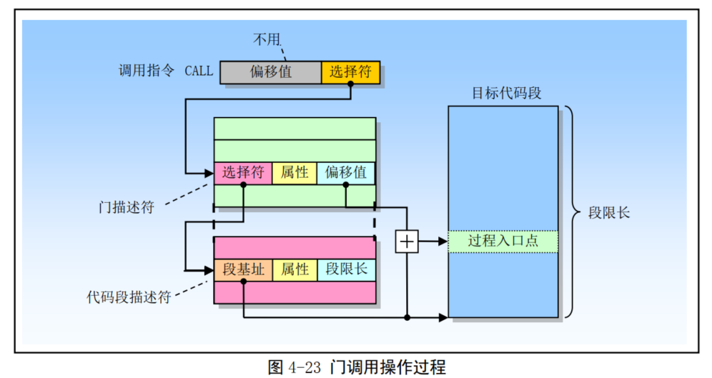

<!-- TOC -->
  * [4.1 80X86 系统寄存器和系统指令](#41-80x86-系统寄存器和系统指令)
    * [4.1.1标志寄存器](#411标志寄存器)
    * [4.1.2 内存管理寄存器](#412-内存管理寄存器)
    * [4.1.3 控制寄存器](#413-控制寄存器)
    * [4.1.4 系统指令](#414-系统指令)
  * [4.2 保护模式内存管理](#42-保护模式内存管理)
    * [4.2.1 内存寻址](#421-内存寻址)
    * [4.2.2 地址变换](#422-地址变换)
    * [4.2.3 保护](#423-保护)
  * [4.3 分段机制](#43-分段机制)
    * [4.3.1 段的定义](#431-段的定义)
    * [4.3.2 段描述符表](#432-段描述符表)
    * [4.3.3 段选择符](#433-段选择符)
    * [4.3.4 段描述符](#434-段描述符)
  * [4.4 分页机制](#44-分页机制)
    * [4.4.1 页表结构](#441-页表结构)
      * [4.4.1.1 两级页表结构](#4411-两级页表结构)
      * [4.4.1.2 不存在的页表](#4412-不存在的页表)
    * [4.4.2 页表项格式](#442-页表项格式)
    * [4.4.3 虚拟内存](#443-虚拟内存)
  * [4.5 保护](#45-保护)
      * [4.5.1 段级保护](#451-段级保护)
      * [4.5.1.1 段限长 Limit 检查](#4511-段限长-limit-检查)
      * [4.5.1.2 段类型 TYPE 检查](#4512-段类型-type-检查)
      * [4.5.1.3 特权级](#4513-特权级)
    * [4.5.2 访问数据段时的特权级检查](#452-访问数据段时的特权级检查)
      * [4.5.3 代码段之间转移控制时的特权级检查](#453-代码段之间转移控制时的特权级检查)
      * [4.5.3.1 直接调用或跳转到代码段](#4531-直接调用或跳转到代码段)
      * [4.5.3.2 门描述符](#4532-门描述符)
      * [4.5.3.3 通过调用门访问代码段](#4533-通过调用门访问代码段)
      * [4.5.3.4 堆栈切换](#4534-堆栈切换)
      * [4.5.3.5 从被调用过程返回](#4535-从被调用过程返回)
    * [4.5.4 页级保护](#454-页级保护)
      * [4.5.4.1 修改页表项的软件问题](#4541-修改页表项的软件问题)
    * [4.5.5组合页级和段级保护](#455组合页级和段级保护)
  * [4.6 中断和异常处理](#46-中断和异常处理)
    * [4.6.1异常和中断向量](#461异常和中断向量)
    * [4.6.2中断源和异常源](#462中断源和异常源)
      * [4.6.2.1 中断源](#4621-中断源)
      * [4.6.2.2 异常源](#4622-异常源)
    * [4.6.3 异常的分类](#463-异常的分类)
    * [4.6.4 程序或任务的重新执行](#464-程序或任务的重新执行)
    * [4.6.5 开启和禁止中断](#465-开启和禁止中断)
    * [4.6.6异常和中断的优先级](#466异常和中断的优先级)
    * [4.6.7 中断描述符表](#467-中断描述符表)
    * [4.6.8IDT 描述符](#468idt-描述符)
    * [4.6.9 异常与中断处理](#469-异常与中断处理)
    * [4.6.10 中断处理任务](#4610-中断处理任务)
    * [4.6.11 错误码](#4611-错误码)
  * [4.7 任务管理](#47-任务管理)
    * [4.7.1 任务的结构和状态](#471-任务的结构和状态)
    * [4.7.2任务的执行](#472任务的执行)
    * [4.7.3任务管理数据结构](#473任务管理数据结构)
      * [4.7.3.1 任务状态段](#4731-任务状态段)
      * [4.7.3.2 TSS 描述符](#4732-tss-描述符)
      * [4.7.3.3 任务寄存器](#4733-任务寄存器)
      * [4.7.3.4 任务门描述符](#4734-任务门描述符)
    * [4.7.4任务切换](#474任务切换)
    * [4.7.5 任务链](#475-任务链)
    * [4.7.6任务地址空间](#476任务地址空间)
      * [4.7.6.1 把任务映射到线性和物理地址空间](#4761-把任务映射到线性和物理地址空间)
      * [4.7.6.2 任务逻辑地址空间](#4762-任务逻辑地址空间)
  * [4.8 保护模式编程初始化](#48-保护模式编程初始化)
    * [4.8.1 进入保护模式时的初始化操作](#481-进入保护模式时的初始化操作)
      * [4.8.1.1 保护模式系统结构表](#4811-保护模式系统结构表)
      * [4.8.1.2 保护模式异常和中断初始化](#4812-保护模式异常和中断初始化)
      * [4.8.1.3 分页机制初始化](#4813-分页机制初始化)
      * [4.8.1.4 多任务初始化](#4814-多任务初始化)
    * [4.8.2模式切换](#482模式切换)
      * [4.8.2.1 切换到保护模式](#4821-切换到保护模式)
      * [4.8.2.2 切换回实地址模式](#4822-切换回实地址模式)
<!-- TOC -->

## 4.1 80X86 系统寄存器和系统指令

### 4.1.1标志寄存器

标志寄存器 EFLAGS 中的系统标志和 IOPL 字段用于控制 I/O 访问、可屏蔽硬件中断、调试、任务切换以及虚拟-8086 模式

### 4.1.2 内存管理寄存器

1、全局描述符表寄存器GDTR Global Description Table Register

2、中断描述符表寄存器 IDTR Interrupt Description Table Register

3、局部描述符表寄存器 LDTR Local Description Table Register

4、任务寄存器 TR Task Register

### 4.1.3 控制寄存器

控制寄存器（ CR0、 CR1、 CR2 和 CR3）用于控制和确定处理器的操作模式以及当前执行任务的特性。

* CR0 中含有控制处理器操作模式和状态的系统控制标志； 
* CR1 保留不用； 
* CR2 含有导致页错误的线性地址。 
* CR3 中含有页目录表物理内存基地址，因此该寄存器也被称为页目录基地址寄存器 PDBR （ Page-Directory Base address Register）

### 4.1.4 系统指令

| 指令 | 指令全名 |受保护 | 说明                                                        |
|:--:|:--|:--|:----------------------------------------------------------|
| LLDT |  Load LDT Register | 是 | 加载局部描述符表寄存器 LDTR。从内存加载 LDT 段选择符和段描述符到 LDTR 寄存器中。          |
| SLDT |  Store LDT Regiter | 否 | 保存局部描述符表寄存器 LDTR。把 LDTR 中的 LDT 段选择符到内存中或通用寄存器中。           |
| LGDT |  Load GDT Register | 是 | 加载全局描述符表寄存器 GDTR。把 GDT 表的基地址和长度从内存加载到 GDTR 中。             |
| SGDT |  Store GDT Register | 否 | 保存全局描述符表寄存器 GDTR。把 GDTR 中 IDT 表的基地址和长度保存到内存中。             |
| LTR  | Load Task Register | 是 | 加载任务寄存器 TR。把 TSS 段选择符（和段描述符）加载到任务寄存器中。                    |
| STR  | Store Task Register | 否 | 保存任务寄存器 TR。把 TR 中当前任务 TSS 段选择符保存到内存或通用寄存其中。               |
| LIDT |  Load IDT Register | 是 | 加载中断描述符表寄存器 IDTR。把 IDT 表的基地址和长度从内存加载到 IDTR 中。             |
| SIDT |  Store IDT Register | 否 | 保存中断描述符表寄存器 IDTR。把 IDTR 中 IDT 表的基地址4.2 保护模式内存管理和长度保存到内存中。 |
| MOV  | CRn Move Control Registers | 是 | 加载和保存控制寄存器 CR0、 CR1、 CR2 或 CR3。                           |
| LMSW |  Load Machine State Word | 是 | 加载机器状态字（对应 CR0 寄存器位 15--0）。该指令用于兼容 80286 处理器。             |
| SMSW |  Store Machine State Word | 否 | 保存机器状态字。该指令用于兼容 80286 处理器。                                |
| CLTS |  Clear TS flag | 是 | 清除 CR0 中的任务已切换标志 TS。用于处理设备（协处理器）不存在异常。                    |
| LSL  | Load Segment Limit | 否 | 加载段限长。                                                    |
| HLT  | Halt Processor | 否 | 停止处理器执行                                                   |

## 4.2 保护模式内存管理

### 4.2.1 内存寻址

内存是指一组有序字节组成的数组，每个字节有唯一的内存地址。内存寻址则是指对存储在内存中的某个指定数据对象的地址进行定位。这里，数据对象是指存储在内存中的一个指定数据类型的数值或字符串。 
80X86 支持多种数据类型： 1 字节、 2 字节（ 1 个字）或 4 字节（双字或长字）的无符号整型数或带符号整型数，以及多字节字符串等。

80X86 使用了一种称为段（ Segment）的寻址技术。这种寻址技术把内存空间分成一个或多个称为段的线性区域，从而对内存中一个数据对象的寻址就需要使用一个段的起始地址（即段地址）和一个段内偏移地址两部分构成。

偏移地址 = 基地址 + （变址 x 比例因子） + 偏移量

### 4.2.2 地址变换

任何完整的内存管理系统都包含两个关键部分：保护和地址变换。
* 提供保护措施可以防止一个任务访问另一个任务或操作系统的内存区域。
* 地址变换能够让操作系统在给任务分配内存时具有灵活性，并且因为我们可以让某些物理地址不被任何逻辑地址所映射，所以在地址变换过程中同时也提供了内存保护功能。

**分段机制**
分段提供了隔绝各个代码、数据和堆栈区域的机制，因此多个程序（或任务）可以运行在同一个处理器上而不会互相干扰。
分页机制为传统需求页、虚拟内存系统提供了实现机制。其中虚拟内存系统用于实现程序代码按要求被映射到物理内存中。分页机制当然也能用于提供多任务之间的隔离措施。

**分页机制**

### 4.2.3 保护

80X86 支持两类保护。
* 其一是通过给每个任务不同的虚拟地址（逻辑地址）空间来完全隔离各个任务。其实现原理是向每个任务提供不同的逻辑地址到物理地址的变换映射。 
* 另一个保护机制对任务进行操作， 以保护操作系统内存段和处理器特殊系统寄存器不被应用程序访问

**1、任务之间的保护**

保护的一个重要方面是提供应用程序各任务之间的保护能力。 80X86 使用的方法是通过把每个任务放置在不同的虚拟地址空间中，并给予每个任务不同的逻辑地址到物理地址的变换映射。
每个任务中的地址变换功能被定义成一个任务中的逻辑地址映射到物理内存的一部分区域，而另一个任务中的逻辑地址映射到物理内存中的不同区域中。
这样，因为一个任务不可能生成能够映射到其他任务逻辑地址对应使用的物 理内存部分，所以所有任务都被隔绝开了。
只需给每个任务各自独立的映射表，每个任务就会有不同的地址变换函数。
在 80X86 中，每个任务都有自己的段表和页表。当处理器切换去执行一个新任务时，任务切换的关键部分就是切换到新任务的变换表。

通过在所有任务中安排具有相同的虚拟到物理地址映射部分，并且把操作系统存储在这个公共的虚拟地址空间部分，操作系统可以被所有任务共享。这个所有任务都具有的相同虚拟地址空间部分被称为全局地址空间（ Global address space）。
这也正是现代 Linux 操作系统使用虚拟地址空间的方式。

每个任务唯一的虚拟地址空间部分被称为局部地址空间（ Local address space）。
局部地址空间含有需要与系统中其他任务区别开的私有的代码和数据。
由于每个任务中具有不同的局部地址空间，因此两个不同任务中对相同虚拟地址处的引用将转换到不同的物理地址处。
这使得操作系统可以给与每个任务的内存相同的虚拟地址，但仍然能隔绝每个任务。另一方面，所有任务在全局地址空间中对相同虚拟地址的引用将被转换到同一个物理地址处。这给公共代码和数据（例如操作系统）的共享提供了支持

**2、特权级保护**

在一个任务中，定义了 4 个执行特权级（ Privilege Levels），用于依据段中含有数据的敏感度以及任务中不同程序部分的受信程度，来限制对任务中各段的访问。最敏感的数据被赋予了最高特权级，它们只能
被任务中最受信任的部分访问。 
不太敏感的数据被赋予较低的特权级，它们可以被任务中较低特权级的代码访问。

## 4.3 分段机制

### 4.3.1 段的定义

段是虚拟地址到线性地址转换机制的基础。每个段由三个参数定义：
1. 段基地址（ Base address），指定段在线性地址空间中的开始地址。基地址是线性地址，对应于段
   中偏移 0 处。
2. 段限长（ limit），是虚拟地址空间中段内最大可用偏移位置。它定义了段的长度。
3. 段属性（ Attributes），指定段的特性。例如该段是否可读、可写或可作为一个程序执行；段的特权级等。

为了把逻辑地址转换成一个线性地址，处理器会执行以下操作：
1. 使用段选择符中的偏移值（段索引）在 GDT 或 LDT 表中定位相应的段描述符。（仅当一个新的段选择符加载到段寄存器中时才需要这一步。）
2. 利用段描述符检验段的访问权限和范围，以确保该段是可访问的并且偏移量位于段界限内。
3. 把段描述符中取得的段基地址加到偏移量上，最后形成一个线性地址。

### 4.3.2 段描述符表

描述符表存储在由操作系统维护着的特殊数据结构中，并且由处理器的内存管理硬件来引用。

### 4.3.3 段选择符

段选择符 3 个字段内容：
* 请求特权级 RPL（ Requested Privilege Level）；
* 表指示标志 TI（ Table Index）；
* 索引值（ Index）。

### 4.3.4 段描述符

## 4.4 分页机制

分页机制是 80X86 内存管理机制的第二部分。它在分段机制的基础上完成虚拟（逻辑）地址到物理地址转换的过程。分段机制把逻辑地址转换成线性地址，而分页则把线性地址转换成物理地址。

### 4.4.1 页表结构

#### 4.4.1.1 两级页表结构

#### 4.4.1.2 不存在的页表

通过使用二级表结构，我们还没有解决需要使用 4MB 内存来存放页表的问题。实际上，我们把问题搞得有些复杂了。
因为我们需要另增一个页面来存放目录表。
然而，二级表结构允许页表被分散在内存各个页面中，而不需要保存在连续的 4MB 内存块中。另外，并不需要为不存在的或线性地址空间未使用部分分配二级页表。
虽然目录表页面必须总是存在于物理内存中，但是二级页表可以在需要时再分配。这使得页表结构的大小对应于实际使用的线性地址空间大小

### 4.4.2 页表项格式

### 4.4.3 虚拟内存

页目录和页表表项中的存在标志 P 为使用分页技术的虚拟存储提供了必要的支持。
若线性地址空间中的页面存在于物理内存中，则对应表项中的标志 P=1，并且该表项中含有相应物理地址。
页面不在物理内存中的表项其标志 P = 0。
如果程序访问物理内存中不存在的页面，处理器就会产生一个缺页异常。
此时操作系统就可以利用这个异常处理过程把缺少的页面从磁盘上调入物理内存中，并把相应物理地址存放在表项中。最后在返回程序重新执行引起异常的指令之前设置标志 P=1。

已访问标志 A 和已修改标志 D 可以用于有效地实现虚拟存储技术。通过周期性地检查和复位所有 A 标志，操作系统能够确定哪些页面最近没有访问过。
这些页面可以成为移出到磁盘上的候选者。
假设当一页面从磁盘上读入内存时，其脏标志 D=0，
那么当页面再次被移出到磁盘上时，若 D 标志还是为 0，则该页面就无需被写入磁盘中。
若此时 D=1，则说明页面内容已被修改过，于是就必须将该页面写到磁盘上。

## 4.5 保护

#### 4.5.1 段级保护
当使用保护机制时，每个内存引用都将受到检察以验证内存引用符合各种保护要求。因为检查操作是与地址变换同时并行操作，所以处理器性能并没有受到影响。所进行的保护检查可分为以下几类：

* 段界限检查；
* 段类型检查；
* 特权级检查；
* 可寻址范围限制；
* 过程入口点限制；
* 指令集限制。

#### 4.5.1.1 段限长 Limit 检查

段描述符的段限长（或称段界限）字段用于防止程序或过程寻址到段外内存位置。

#### 4.5.1.2 段类型 TYPE 检查

除了应用程序代码和数据段有描述符以外，处理器还有系统段和门两种描述符类型。这些数据结构用于管理任务以及异常和中断。
请注意，并非所有的描述符都定义一个段，门描述符中存放有指向一个过程入口点的指针。
段描述符在两个地方含有类型信息，即描述符中的 S 标志和类型字段 TYPE。处理器利用这些信息对由于非法使用段或门导致的编程错误进行检测

#### 4.5.1.3 特权级

处理器的段保护机制可以识别 4 个特权级（或特权层）， 0 级到 3 级。数值越大，特权越小

为了在各个代码段和数据段之间进行特权级检测处理，处理器可以识别以下三种类型的特权级：

**当前特权级 CPL（ Current Privilege Level）**

CPL 是当前正在执行程序或任务的特权级。 它存放在CS 和 SS 段寄存器的位 0 和位 1 中。
通常， CPL 等于当前代码段的特权级。当程序把控制转移到一个具有不同特权级的代码段中时，处理器就会改变 CPL。
当访问一个一致性（ conforming）代码段时，则处理器对 CPL 的设置有些不同。
特权级值高于（即低特权级）或等于一致代码段DPL 的任何段都可以访问一致代码段。
并且当处理器访问一个特权级不同于 CPL 的一致代码段时， CPL 并不会被修改成一致代码段的 DPL

**描述符特权级 DPL（ Descriptor Privilege Level）**

DPL 是一个段或门的特权级。它存放在段或门描述符的 DPL 字段中。
当前执行代码段试图访问一个段或门时，段或门的 DPL 会用来与 CPL 以及段或门选择符中的 RPL作比较。

**请求特权级 RPL（ Request Privilege Level）**

RPL 是一种赋予段选择符的超越特权级，它存放在选符的位 0 和位 1 中。处理器会同时检查 RPL 和 CPL，以确定是否允许访问一个段。
即使程序或任务具有足够的特权级（ CPL）来访问一个段，但是如果提供的 RPL 特权级不足的话访问也将被拒绝。

### 4.5.2 访问数据段时的特权级检查

为了访问数据段中的操作数，数据段的段选择符必须被加载进数据段寄存器（ DS、 ES、 FS 或 GS）或堆栈段寄存器（ SS）中
在把一个段选择符加载进段寄存器中之前，处理器会进行特权级检查

#### 4.5.3 代码段之间转移控制时的特权级检查

对于将程序控制权从一个代码段转移到另一个代码段，目标代码段的段选择符必须加载进代码段寄存器（ CS）中。
作为这个加载过程的一部分，处理器会检测目标代码段的段描述符并执行各种限长、类型和特权级检查。
如果这些检查都通过了，则目标代码段选择符就会加载进 CS 寄存器，于是程序的控制权就被转移到新代码段中，程序将从 EIP 寄存器指向的指令处开始执行。
程序的控制转移使用指令 JMP、 RET、 INT 和 IRET 以及异常和中断机制来实现。
异常和中断是一些特殊实现，将在后面描述，本节主要说明 JMP、 CALL 和 RET 指令的实现方法。 JMP 或 CALL 指令可以
利用一下四种方法之一来引用另外一个代码段：
* 目标操作数含有目标代码段的段选择符；
* 目标操作数指向一个调用门描述符，而该描述符中含有目标代码段的选择符；
* 目标操作数指向一个 TSS，而该 TSS 中含有目标代码段的选择符；
* 标操作数指向一个任务门，该任务门指向一个 TSS，而该 TSS 中含有目标代码段的选择符

#### 4.5.3.1 直接调用或跳转到代码段

JMP、 CALL 和 RET 指令的近转移形式只是在当前代码段中执行程序控制转移，因此不会执行特权级检查。 
JMP、 CALL 或 RET 指令的远转移形式会把控制转移到另外一个代码段中，因此处理器一定会之醒特权级检查

当不通过调用门把程序控制权转移到另一个代码段时，处理器会验证 4 种特权级和类型信息:

* 当前特权级 CPL。（这里， CPL 是执行调用的代码段的特权级，即含有执行调用或跳转程序的代
码段的 CPL。）
* 含有被调用过程的目的代码段段描述符中的描述符特权级 DPL。
* 目的代码段的段选择符中的请求特权级 RPL。
* 目的代码段描述符中的一致性标志 C。它确定了一个代码段是非一致代码段还是一致代码段。

#### 4.5.3.2 门描述符

调用门用于在不同特权级之间实现受控的程序控制转移。它们通常仅用于使用特权级保护机制的操作系统中。 
图 4-22 给出了调用门描述符的格式。调用门描述符可以存放在 GDT 或 LDT 中，但是不能放在中断描述符表 IDT 中。一个调用门主要具有一下几个功能：
* 指定要访问的代码段；
* 在指定代码段中定义过程（程序）的一个入口点；
* 指定访问过程的调用者需具备的特权级；
* 若会发生堆栈切换，它会指定在堆栈之间需要复制的可选参数个数；
* 指明调用门描述符是否有效

#### 4.5.3.3 通过调用门访问代码段

通过调用门进行程序控制转移时， CPU 会对 4 中不同的特权级进行检查:
* 当前特权级 CPL；
* 调用门选择符中的请求特权级 RPL；
* 调用门描述符中的描述符特权级 DPL；
* 目的代码段描述符中的 DPL；

#### 4.5.3.4 堆栈切换

每当调用门用于把程序控制转移到一个更高级别的非一致性代码段时， CPU 会自动切换到目的代码段特权级的堆栈去。
执行栈切换操作的目的是为了防止高特权级程序由于栈空间不足而引起崩溃，同时也为了防止低特权级程序通过共享的堆栈有意或无意地干扰高特权级的程序

操作系统需要负责为所有用到的特权级建立堆栈和堆栈段描述符，并且在任务的 TSS 中设置初始指针
值。每个栈必须可读可写，并且具有足够的空间来存放以下一些信息：
* 调用过程的 SS、 ESP、 CS 和 EIP 寄存器内容；
* 被调用过程的参数和临时变量所需使用的空间。
* 当隐含调用一个异常或中断过程时标志寄存器 EFLAGS 和出错码使用的空间。

当通过调用门执行一个过程调用而造成特权级改变时， CPU 就会执行以下步骤切换堆栈并开始在新的特权级上执行被调用过程:
1. 使用目的代码段的 DPL（即新的 CPL）从 TSS 中选择新栈的指针。从当前 TSS 中读取新栈的段选择符和栈指针。在读取栈段选择符、栈指针或栈段描述符过程中，任何违反段界限的错误都将导致产生一个无效 TSS 异常；
2. 检查栈段描述符特权级和类型是否有效，若无效者同样产生一个无效 TSS 异常。
3. 临时保存 SS 和 ESP 寄存器的当前值，把新栈的段选择符和栈指针加载到 SS 和 ESP 中。然后把临时保存的 SS 和 ESP 内容压入新栈中。
4. 把调用门描述符中指定参数个数的参数从调用过程栈复制到新栈中。调用门中参数个数值最大为 31，如果个数为 0，则表示无参数，不需复制。
5. 把返回指令指针（即当前 CS 和 EIP 内容）压入新栈。把新（目的）代码段选择符加载到 CS 中， 同时把调用门中偏移值（新指令指针）加载到 EIP 中。最后开始执行被调用过程。

#### 4.5.3.5 从被调用过程返回

当执行远返回到一个调用过程时， CPU 会执行以下步骤：
1. 检查保存的 CS 寄存器中 RPL 字段值，以确定在返回时特权级是否需要改变。
2. 弹出并使用被调用过程堆栈上的值加载 CS 和 EIP 寄存器。在此过程中会对代码段描述符和代码 段选择符的 RPL 进行特权级与类型检查。
3. 如果 RET 指令包含一个参数个数操作数并且返回操作会改变特权级，那么就在弹出栈中 CS 和 EIP 值之后把参数个数值加到 ESP 寄存器值中，以跳过（丢弃）被调用者栈上的参数。此时 ESP 寄存 器指向原来保存的调用者堆栈的指针 SS 和 ESP。
4. 把保存的 SS 和 ESP 值加载到 SS 和 ESP 寄存器中，从而切换回调用者的堆栈。而此时被调用者堆 栈的 SS 和 ESP 值被抛弃。
5. 如果 RET 指令包含一个参数个数操作数，则把参数个数值加到 ESP 寄存器值中，以跳过（丢弃） 调用者栈上的参数。
6. 检查段寄存器 DS、 ES、 FS 和 GS 的内容。如果其中有指向 DPL 小于新 CPL 的段（一致代码段除外），那么 CPU 就会用 NULL 选择符加载加载这个段寄存器。

### 4.5.4 页级保护

页目录和页表表项中的读写标志 R/W 和用户/超级用户标志 U/S 提供了分段机制保护属性的一个子集。
分页机制只识别两级权限。特权级 0、 1 和 2 被归类为超级用户级，而特权级 3 被作为普通用户级。
普通用户级的页面可以被标志成只读/可执行或可读/可写/可执行。超级用户级的页面对于超级用户来讲总是可读/可写/可执行的，但普通用户不可访问

#### 4.5.4.1 修改页表项的软件问题

80X86 处理器并没有维护页转换高速缓冲和页表中数据的相关性，但是需要操作系统软件来确保它们一致。
即处理器并不知道什么时候页表被软件修改过了。因此操作系统必须在改动过页表之后刷新高速缓冲以确保两者一致。通过简单地重新加载寄存器 CR3，我们就可以完成对高速缓冲的刷新操作。

### 4.5.5组合页级和段级保护

当启用了分页机制， CPU 会首先执行段级保护，然后再处理页级保护。如果 CPU 在任何一级检测到一个保护违规错误，则会放弃内存访问并产生一个异常。
如果是段机制产生的异常，那么就不会再产生一个页异常。

页级保护不能替代或忽略段级保护。例如，若一个代码段被设定为不可写，那么代码段被分页后，即使页面的 R/W 标志被设置成可读可写也不会让页面可写。
此时段级保护检查会阻止任何对页面的写操作企图。页级保护可被用来增强段级保护。
例如， 如果一个可读可写数据段被分页，那么页级保护机制可用来对个别页面进行写保护。

## 4.6 中断和异常处理

中断（ Interrupt）和异常（ Exception）是指明系统、处理器或当前执行程序（或任务）的某处出现一个事件，该事件需要处理器进行处理。
通常，这种事件会导致执行控制被强迫从当前运行程序转移到被称为中断处理程序（ interrupt handler）或异常处理程序（ exception handler）的特殊软件函数或任务中。
处理器响应中断或异常所采取的行动被称为中断/异常服务（处理）。

### 4.6.1异常和中断向量

为了有助于处理异常和中断，每个需要被处理器进行特殊处理的处理器定义的异常和中断条件都被赋予了一个标识号，称为向量（ vector）。
处理器把赋予异常或中断的向量用作中断描述符表 IDT（ Interrupt Descriptor Table）中的一个索引号，来定位一个异常或中断的处理程序入口点位置。

### 4.6.2中断源和异常源

#### 4.6.2.1 中断源

处理器由两个地方接收中断：
* 外部（硬件产生）的中断
* 软件产生的中断

#### 4.6.2.2 异常源

处理器接受的异常也是两个来源：
* 处理器检测到的程序错误的异常
* 软件产生的异常

### 4.6.3 异常的分类

* Fault 是一种通常可以被纠正的异常，并且一旦被纠正程序就可以继续运行。
* Trap 是一个引起陷阱的指令被执行后立刻会报告的异常。
* Abort 是一种不会总是报告导致异常的指令的精确位置的异常，并且不允许导致异常的程序重新继续执行

### 4.6.4 程序或任务的重新执行

为了让程序或任务在一个异常或中断处理完之后能重新恢复执行，除了中止（ Abort）之外的所有异常都能报告精确的指令位置，并且所有中断保证是在指令边界上发生。

* 对于故障类异常，处理器产生异常时保存的返回指针指向出错指令。因为，当程序或任务在故障处理程序返回后重新开始执行时，原出错指令会被重新执行。
重新执行引发出错的指令通常用于处理访问指令操作数受阻的情况。
* 对于故障类异常，处理器产生异常时保存的返回指针指向出错指令。因为，当程序或任务在故障处理
  程序返回后重新开始执行时，原出错指令会被重新执行。重新执行引发出错的指令通常用于处理访问指令
  操作数受阻的情况。
* 中止 Abort 类异常不支持可靠地重新执行程序或任务。中止异常的处理程序通常用来收集异常发生时
  有关处理器状态的诊断信息，并且尽可能恰当地关闭程序和系统

### 4.6.5 开启和禁止中断

标志寄存器 EFLAGS 的中断允许标志 IF（ Interrupt enable Flag）能够禁止为处理器 INTR 引脚上收到的可屏蔽硬件中断提供服务。
当 IF=0 时，处理器禁止发送到 INTR 引脚的中断；
当 IF=1 时，则发送到 INTR引脚的中断信号会被处理器进行处理。

### 4.6.6异常和中断的优先级

### 4.6.7 中断描述符表

中断描述符表 IDT（ Interrupt Descriptor Table）将每个异常或中断向量分别与它们的处理过程联系起来

### 4.6.8IDT 描述符

IDT 表中可以存放三种类型的门描述符：
* 中断门（ Interrupt gate）描述符
* 陷阱门（ Trap gate）描述符
* 任务门（ Task gate）描述符

### 4.6.9 异常与中断处理

处理器对异常和中断处理过程的调用操作方法与使用 CALL 指令调用程序过程和任务的方法类似。
当响应一个异常或中断时，处理器使用异常或中断的向量作为 IDT 表中的索引。
如果索引值指向中断门或陷阱门，则处理器使用与 CALL 指令操作调用门类似的方法调用异常或中断处理过程。
如果索引值指向任务门，则处理器使用与 CALL 指令操作任务门类似的方法进行任务切换，执行异常或中断的处理任务。

**当处理器执行异常或中断处理过程调用时会进行以下操作：**

**如果处理过程将在高特权级（例如 0 级）上执行时就会发生堆栈切换操作。堆栈切换过程如下：**
1. 处理器从当前执行任务的 TSS 段中得到中断或异常处理过程使用的堆栈的段选择符和栈指针（例如 tss.ss0、 tss.esp0）。然后处理器会把被中断程序（或任务）的栈选择符和栈指针压入新栈中，见图 4-29 所示。
2. 接着处理器会把 EFLAGS、 CS 和 EIP 寄存器的当前值也压入新栈中。
3. 如果异常会产生一个错误号，那么该错误号也会被最后压入新栈中。

**如果处理过程将在被中断任务同一个特权级上运行**
1. 处理器把 EFLAGS、 CS 和 EIP 寄存器的当前值保存在当前堆栈上。 
2. 如果异常会产生一个错误号，那么该错误号也会被最后压入新栈中。

1、异常和中断处理过程的保护

异常和中断处理过程的特权级保护机制与通过调用门调用普通过程类似。处理器不允许把控制转移到比 CPL 更低特权级代码段的中断处理过程中，否则将产生一个一般保护性异常。
另外，中断和异常的保护机制在以下方面与一般调用门过程不同：
* 因为中断和异常向量没有 RPL，因此在隐式调用异常和中断处理过程时不会检查 RPL
* 只有当一个异常或中断是利用使用 INT n、 INT 3 或 INTO 指令产生时，处理器才会检查中断或陷阱门中的 DPL。
此时 CPL 必须小于等于门的 DPL。这个限制可以防止运行在特权级 3 的应用程序使用软件中断访问重要的异常处理过程，例如页错误处理过程，
假设这些处理过程已被存放在更高特权级的代码段中。对于硬件产生的中断和处理器检测到的异常，处理器会忽略中断门和陷阱门中的 DPL。

2、异常或中断处理过程的标志使用方式

当通过中断门或陷阱门访问一个异常或中断处理过程时，处理器会在把 EFLAGS 寄存器内容保存到堆栈上之后清除 EFLAGS 中的 TF 标志。
清除 TF 标志可以防止指令跟踪影响中断响应。而随后的 IRET 指令会用堆栈上的内容恢复 EFLAGS 的原 TF 标志。

中断门与陷阱门唯一的区别在于处理器操作 EFLAGS 寄存器 IF 标志的方法。
当通过中断门访问一个异常或中断处理过程时，处理器会复位 IF 标志以防止其他中断干扰当前中断处理过程。
随后的 IRET 指令则会用保存在堆栈上的内容恢复 EFLAGS 寄存器的 IF 标志。而通过陷阱门访问处理过程并不会影响 IF 标志。

### 4.6.10 中断处理任务

当通过 IDT 中任务门来访问异常或中断处理过程时就会导致任务切换。使用单独的任务来处理异常或中断有如下好处：

* 被中断程序或任务的完整上下文会被自动保存；
* 在处理异常或中断时，新的 TSS 可以允许处理过程使用新特权级 0 的堆栈。在当前特权级 0 的堆栈已毁坏时如果发生了一个异常或中断，那么在为中断过程提供一个新特权级 0 的堆栈条件下，过任务门访问中断处理过程能够防止系统崩溃；
* 通过使用单独的 LDT 给中断或异常处理任务独立的地址空间，可以把它与其他任务隔离开来。

### 4.6.11 错误码

当异常条件与一个特定的段相关时，处理器会把一个错误码压入异常处理过程的堆栈上。出错码的格式见图 4-31 所示。错误码很象一个段选择符，但是最低 3 比特不是 TI 和 RPL 字段，而是以下 3 个标志：

* 位 0 是外部事件 EXT（ External event）标志。当置位时，表示执行程序以外的事件造成了异常， 例如硬件中断。
* 位 1 是描述符位置 IDT（ Descriptor location）标志。当该位置位时，表示错误码的索引部分指向IDT 中的一个门描述符。当该位复位时，表示索引部分指向 GDT 或 LDT 中的一个段描述符。
* 位 2 是 GDT/LDT 表选择标志 TI。只有当位 1 的 IDT=0 才有用。当该 TI=1 时，表示错误码的索引部分指向 LDT 中的一个描述符。当 TI=0 时，说明错误码中的索引部分指向 GDT 表中的一个描述符、

## 4.7 任务管理

任务（ Task）是处理器可以分配调度、执行和挂起的一个工作单元。它可用于执行程序、任务或进程、 操作系统服务、中断或异常处理过程和内核代码。

80X86 提供了一种机制，这种机制可用来保存任务的状态、分派任务执行以及从一个任务切换到另一 个任务。

### 4.7.1 任务的结构和状态

一个任务由两部分构成：任务执行空间和任务状态段 TSS（ Task-state segment）。
任务执行空间包括代码段、堆栈段和一个或多个数据段。
TSS 指定了构成任务执行空间的各个段，并且为任务状态信息提供存储空间。

一个任务使用指向其 TSS 的段选择符来指定。 
当一个任务被加载进处理器中执行时，那么该任务的段选择符、基地址、段限长以及 TSS 段描述符属性就会被加载进任务寄存器 TR（ Task Register）中。
如果使用了分页机制，那么任务使用的页目录表基地址就会被加载进控制寄存器 CR3 中。
当前执行任务的状态由处理器所有以下一些内容组成：
* 所有通用寄存器和段寄存器信息；
* 标志寄存器 EFLAGS、程序指针 EIP、控制寄存器 CR3、任务寄存器和 LDTR 寄存器；
* 段寄存器指定的任务当前执行空间；
* I/O 映射位图基地址和 I/O 位图信息（在 TSS 中）；
* 特权级 0、 1 和 2 的堆栈指针（在 TSS 中）；
* 链接至前一个任务的链指针（在 TSS 中）。

### 4.7.2任务的执行

软件或处理器可以使用以下方法之一来调度执行一个任务：
* 使用 CALL 指令明确地调用一个任务；
* 使用 JMP 指令明确地跳转到一个任务（ Linux 内核使用的方式）； 
*（由处理器）隐含地调用一个中断句柄处理任务；
* 隐含地调用一个异常句柄处理任务；

如果当前执行任务（调用者）调用了被调度的新任务（被调用者），那么调用者的 TSS 段选择符会被保存在被调用者 TSS 中，从而提供了一个返回调用者的链接。

### 4.7.3任务管理数据结构
处理器定义了一下一些支持多任务的寄存器和数据结构：
* 任务状态段 TSS；
* TSS 描述符；
* 任务寄存器 TR；
* 任务门描述符；
* 标志寄存器 EFLAGS 中的 NT 标志

#### 4.7.3.1 任务状态段

用于恢复一个任务执行的处理器状态信息被保存在称为任务状态段 TSS（ Task state segment）的段中。

**1、动态字段。当任务切换而被挂起时，处理器会更新动态字段的内容**。这些字段包括：
* 通用寄存器字段。用于保存 EAX、 ECX、 EDX、 EBX、 ESP、 EBP、 ESI 和 EDI 寄存器的内容。
* 段选择符字段。用于保存 ES、 CS、 SS、 DS、 FS 和 GS 段寄存器的内容。
* 标志寄存器 EFLAGS 字段。在切换之前保存 EFLAGS。
* 指令指针 EIP 字段。在切换之前保存 EIP 寄存器内容。
* 先前任务连接字段。含有前一个任务 TSS 段选择符（在调用、中断或异常激发的任务切换时更新）。

**2、静态字段。处理器会读取静态字段的内容，但通常不会改变它们。这些字段内容是在任务被创建时设置的**。这些字段有：
* LDT 段选择符字段。含有任务的 LDT 段的选择符。
* CR3 控制寄存器字段。含有任务使用的页目录物理基地址。控制寄存器 CR3 通常也被称为页目录基地址寄存器 PDBR（ Page directory base register）。
* 特权级 0、 1 和 2 的堆栈指针字段。这些堆栈指针由堆栈段选择符（ SS0、 SS1 和 SS2）和栈中偏移量指针（ ESP0、 ESP1 和 ESP2）组成。注意，对于指定的一个任务，这些字段的值是不变的。因此，如果任务中发生堆栈切换，寄存器 SS 和 ESP 的内容将会改变。
* 调试陷阱（ Debug Trap） T 标志字段。该字段位于字节 0x64 比特 0 处。当设置了该位时，处理器切换到该任务的操作将产生一个调试异常。
* I/O 位图基地址字段。该字段含有从 TSS 段开始处到 I/O 许可位图处的 16 位偏移值

#### 4.7.3.2 TSS 描述符

#### 4.7.3.3 任务寄存器

任务寄存器 TR（ Task Register）中存放着 16 位的段选择符以及当前任务 TSS 段的整个描述符（不可见部分）。
这些信息是从 GDT 中当前任务的 TSS 描述符中复制过来的。处理器使用任务寄存器 TR 的不可见部分来缓冲 TSS 段描述符内容。

指令 LTR 和 STR 分别用于加载和保存任务寄存器的可见部分，即 TSS 段的选择符。 
LTR 指令只能被特权级 0 的程序执行。
LTR 指令通常用于系统初始化期间给 TR 寄存器加载初值（例如，任务 0 的 TSS 段选择符），随后在系统运行期间， TR 的内容会在任务切换时自动地被改变。

#### 4.7.3.4 任务门描述符

务门描述符（ Task gate descriptor）提供对一个任务间接、受保护地的引用，其格式见图所示。任务门描述符可以被存放在 GDT、 LDT 或 IDT 表中。

任务门描述符中的 TSS 选择符字段指向 GDT 中的一个 TSS 段描述符。这个 TSS 选择符字段中的 RPL域不用。
任务门描述符中的 DPL 用于在任务切换时控制对 TSS 段的访问。
当程序通过任务门调用或跳转到一个任务时，程序的 CPL 以及指向任务门的门选择符的 RPL 值必须小于或等于任务门描述符中的 DPL。
请注意，当使用任务门时，目标 TSS 段描述符的 DPL 忽略不用。

### 4.7.4任务切换

处理器可使用一下 4 种方式之一执行任务切换操作：
1. 当前任务对 GDT 中的 TSS 描述符执行 JMP 或 CALL 指令；
2. 当前任务对 GDT 或 LDT 中的任务门描述符执行 JMP 或 CALL 指令；
3. 中断或异常向量指向 IDT 表中的任务门描述符；
4. 当 EFLAGS 中的 NT 标志置位时当前任务执行 IRET 指令。

当切换到一个新任务时，处理器会执行一下操作：
1. 从作为 JMP 或 CALL 指令操作数中，或者从任务门中，或者从当前 TSS 的前一任务链接字段（对于由 IRET 引起的任务切换）中取得新任务的 TSS 段选择符。
2. 检查当前任务是否允许切换到新任务。把数据访问特权级规则应用到 JMP 和 CALL 指令上。当前任务的 CPL 和新任务段选择符的 RPL 必须小于或等于 TSS 段描述符的 DPL，或者引用的是一个 任务门。无论目标任务门或 TSS 段描述符的 DPL 是何值，异常、中断（除了使用 INT n 指令产生的中断）和 IRET 指令都允许执行任务切换。对于 INT n 指令产生的中断将检查 DPL。
3. 检查新任务的 TSS 描述符是标注为存在的（ P=1），并且 TSS 段长度有效（大于 0x67）。当试图执行会产生错误的指令时，都会恢复对处理器状态的任何改变。这使得异常处理过程的返回地址指向出错指令，而非出错指令随后的一条指令。因此异常处理过程可以处理出错条件并且重新执行 任务。异常处理过程的介入处理对应用程序来说是完全透明的。
4. 如果任务切换产生自 JMP 或 IRET 指令，处理器就会把当前任务（老任务） TSS 描述符中的忙标志 B 复位；如果任务切换是由 CALL 指令、异常或中断产生，则忙标志 B 不动。
5. 如果任务切换由 IRET 产生，则处理器会把临时保存的 EFLAGS 映像中的 NT 标志复位；如果任务切换由 CALL、 JMP 指令或者异常或中断产生，则不用改动上述 NT 标志。
6. 把当前任务的状态保存到当前任务的 TSS 中。处理器会从任务寄存器中取得当前任务 TSS 的基地址，并且把一下寄存器内容复制到当前 TSS 中：所有通用寄存器、段寄存器中的段选择符、标志寄存器 EFLAGS 以及指令指针 EIP
7. 如果任务切换是由 CALL 指令、异常或中断产生，则处理器就会把从新任务中加载的 EFLAGS 中的 NT 标志置位。如果任务切换产生自 JMP 或 IRET 指令，就不改动新加载 EFLAGS 中的标志。
8. 如果任务切换由 CALL、 JMP 指令或者异常或中断产生，处理器就会设置新任务 TSS 描述符中的忙标志 B。如果任务切换由 IRET 产生，则不去改动 B 标志
9. 使用新任务 TSS 的段选择符和描述符加载任务寄存器 TR（包括隐藏部分）。设置 CR0 寄存器的 TS 标志。
10. 把新任务的 TSS 状态加载进处理器。这包括 LDTR 寄存器、 PDBR（ CR3）寄存器、 EFLAGS 寄存器、 EIP 寄存器以及通用寄存器和段选择符。在此期间检测到的任何错误都将出现在新任务的上下文中
11. 开始执行新任务（对于异常处理过程，新任务的第一条指令显现出还没有执行）

### 4.7.5 任务链

TSS 的前一任务连接（ Backlink）字段以及 EFLAGS 中的 NT 标志用于返回到前一个任务操作中。 
NT标志指出了当前执行的任务是否是嵌套在另一个任务中执行，并且当前任务的前一任务连接字段中存放着嵌套层中更高层任务的 TSS 选择符，若有的话

当 CALL 指令、中断或异常造成任务切换，处理器把当前 TSS 段的选择符复制到新任务 TSS 段的前一任务链接字段中，然后在 EFLAGS 中设置 NT 标志。 
NT 标志指明 TSS 的前一任务链接字段中存放有保存的 TSS 段选择符。
如果软件使用 IRET 指令挂起新任务，处理器就会使用前一任务链接字段中值和 NT 标志返回到前一个任务。也即如果 NT 标志是置位的话，处理器会切换到前一任务链接字段指定的任务去执行

### 4.7.6任务地址空间

任务的地址空间由任务能够访问的段构成。这些段包括代码段、数据段、堆栈段、 TSS 中引用的系统段以及任务代码能够访问的任何其他段。
这些段都被映射到处理器的线性地址空间中，并且随后被直接地或者通过分页机制映射到处理器的物理地址空间中

#### 4.7.6.1 把任务映射到线性和物理地址空间
有两种方法可以把任务映射到线性地址空间和物理地址空间
* 所有任务共享一个线性到物理地址空间的映射。当没有开启分页机制时，就只能使用这个办法。
  不开启分页时，所有线性地址映射到相同的物理地址上。当开启了分页机制，那么通过让所有任
  务使用一个页目录，我们就可以使用这种从线性到物理地址空间的映射形式。如果支持需求页虚
  拟存储技术，则线性地址空间可以超过现有物理地址空间的大小。
* 每个任务有自己的线性地址空间，并映射到物理地址空间。通过让每个任务使用不同的页目录，
  我们就可以使用这种映射形式。因为每次任务切换都会加载 PDBR（控制寄存器 CR3），所以每
  个任务可以有不同的页目录

#### 4.7.6.2 任务逻辑地址空间
为了在任务之间共享数据，可使用下列方法之一来为数据段建立共享的逻辑到物理地址空间的映射：
* **通过使用 GDT 中的段描述符**。所有任务必须能够访问 GDT 中的段描述符。如果 GDT 中的某些段描
述符指向线性地址空间中的一些段，并且这些段被映射到所有任务共享的物理地址空间中，那么所有任务
都可以共享这些段中的代码和数据。
* **通过共享的 LDT**。两个或多个任务可以使用相同的 LDT，如果它们 TSS 中 LDT 字段指向同一个 LDT。
如果一个共享的 LDT 中某些段描述符指向映射到物理地址空间公共区域的段，那么共享 LDT 的所有任务
可以共享这些段中的所有代码和数据。这种共享方式要比通过 GDT 来共享好，因为这样做可以把共享局
限于指定的一些任务中。系统中有与此不同 LDT 的其他任务没有访问这些共享段的权利。
* **通过映射到线性地址空间公共地址区域的不同 LDT 中的段描述符**。如果线性地址空间中的这个公共
区域对每个任务都映射到物理地址空间的相同区域，那么这些段描述符就允许任务共享这些段。这样的段
描述符通常称为别名段。这个共享方式要比上面给出的方式来得更好，因为 LDT 中的其他段描述符可以
指向独立的未共享线性地址区域

## 4.8 保护模式编程初始化

### 4.8.1 进入保护模式时的初始化操作

保护模式所需要的一些数据结构由处理器内存管理功能确定。
处理器支持分段模型，可以使用从单个、统一的地址空间平坦模型到每个任务都具有几个受保护地址空间的高度结构化的多段模型。
分页机制能够用来部分在内存、部分在磁盘上的大型数据结构信息。
这两种地址转换形式都需要操作系统在内存中为内存管理硬件设置所要求的数据结构。
因此在处理器能够被切换到保护模式下运行之前，操作系统加载和初始化软件（ bootsect.s、 setup.s 和 head.s）必须在内存中先设置好保护模式下使用的数据结构的基本信息。
这些数据结构包括以下几种：
* 保护模式中断描述符表 IDT；
* 全局描述符表 GDT；
* 任务状态段 TSS；
* 局部描述符表 LDT；
* 若使用分页机制，则起码需要设置一个页目录和一个页表；
* 处理器切换到保护模式下运行的代码段；
* 含有中断和异常处理程序的代码模块

在能够切换到保护模式之前，软件初始化代码还必须设置以下系统寄存器：
* 全局描述符表基地址寄存器 GDTR；
*  中断描述符表基地址寄存器 IDTR；
*  控制寄存器 CR1--CR3；
在初始化了这些数据结构、代码模块和系统寄存器之后，通过设置 CR0 寄存器的保护模式标志 PE（位0），处理器就可以切换到保护模式下运行

#### 4.8.1.1 保护模式系统结构表

软件初始化期间在内存中设置的保护模式系统表主要依赖于操作系统将要支持的内存管理类型：
* 平坦的、
* 平坦并支持分页的、
* 分段的或者分段并支持分页的。

为了实现无分页的平坦内存模型，软件初始化代码必须起码设置具有一个代码段和一个数据段的 GDT 表。
当然 GDT 表第 1 项还需要放置一个空描述符。堆栈可以放置在普通可读写数据段中，因此并不需要专门的堆栈描述符。
支持分页机制的平坦内存模型还需要一个页目录和至少一个页表。在可以使用 GDT 表之前，必须使用 LGDT 指令把 GDT 表的基地址和长度值加载到 GDTR 寄存器中。

而多段模型则还需要用于操作系统的其他段，以及用于每个应用程序的段和 LDT 表段。 
LDT 表的段描述符要求存放在 GDT 表中。某些操作系统会为应用程序另行分配新段和新的 LDT 段。
这种做法为动态编程环境提供了最大灵活性，例如 Linux 操作系统就使用了这种方式。
象过程控制器那样的嵌入式系统可以预先为固定数量的应用程序分配固定数量的段和 LDT，这是实现实时系统软件环境结构的一种简单而有效的方法。

#### 4.8.1.2 保护模式异常和中断初始化

软件初始化代码必须设置一个保护模式 IDT，其中最少需要含有处理器可能产生的每个异常向量对应的门描述符。
如果使用了中断或陷阱门，那么门描述符可以都指向包含中断和异常处理过程的同一个代码段。
若使用了任务门，那么每个使用任务门的异常处理过程都需要一个 TSS 以及相关的代码、数据和堆栈段。
如果允许硬件产生中断，那么必须在 IDT 中为一个或多个中断处理过程设置门描述符。 在可以使用 IDT 之前，必须使用 LIDT 指令把 IDT 表基地址和长度加载到 IDTR 寄存器中

#### 4.8.1.3 分页机制初始化

分页机制由控制寄存器 CR0 中的 PG 标志设置。当这个标志被清 0 时（即硬件复位时的状态），分页
机制被关闭；当设置了 PG 标志，就开启分页机制。在设置 PG 标志之前，必须先初始化以下数据结构和
寄存器：
* 软件必须在物理内存中建立至少一个页目录和一个页表。如果页目录表中含有指向自身的目录项时，可以不使用页表。此时页目录表和页表被存放在同一页面中。
* 把页目录表的物理基地址加载到 CR3 寄存器中（也称为 PDBR 寄存器）。
* 处理器处于保护模式下。如果满足所有其他限制，则 PG 和 PE 标志可以同时设置。

为保持兼容性，设置 PG 标志（以及 PE 标志）时必须遵守以下规则：
* 设置 PG 标志的指令应该立刻跟随一条 JMP 指令。 MOV CR0 指令后面的 JMP 指令会改变执行流，所以它会清空 80X86 处理器已经取得或已译码的指令。然而， Pentium 及以上处理器使用了分支目标缓冲器 BTB（ Branch Target Buffer）为分支代码定向，因此减去了为分支指令刷新队列的需要。
* 设置 PG 标志到跳转指令 JMP 之间的代码必须来自对等映射（即跳转之前的线性地址与开启分页后的物理地址相同）的一个页面上。

#### 4.8.1.4 多任务初始化

如果将要使用多任务机制，并且/或者允许改变特权级，那么软件初始化代码必须至少设置一个 TSS 及相应的 TSS 段描述符（因为特权级 0、 1 和 2 的各栈段指针需要从 TSS 中取得）。
在创建 TSS 描述符时不要将其标注为忙（不要设置忙标志），该标志仅由处理器在执行任务切换时设置。与 LDT 段描述符相同，TSS 的描述符也存放在 GDT 中

在处理器切换到保护模式之后，可以用 LTR 指令把 TSS 段描述符的选择符加载到任务寄存器 TR 中。 这个指令会把 TSS 标记成忙状态（ B=1），但是并不执行任务切换操作。
然后处理器可以使用这个 TSS 来定位特权级 0、 1 和 2 的堆栈。
在保护模式中，软件进行第一次任务切换之前必须首先加载 TSS 段的选择符，因为任务切换会把当前任务状态复制到该 TSS 中。
在 LTR 指令执行之后，随后对任务寄存器的操作由任务切换进行。与其他的段和 LDT 类似， TSS 段和 TSS 段描述符可以预先设置好，也可以在需要时进行设置。

### 4.8.2模式切换

为了让处理器工作在保护模式下，必须从实地址模式下进行模式切换操作。一旦进入保护模式，软件通常不会再需要回到实地址模式。
为了还能运行为实地址模式编制的程序，通常在虚拟-8086 模式中运行比再切换回实模式下运行更为方便。

#### 4.8.2.1 切换到保护模式

在切换到保护模式之前，必须首先加载一些起码的系统数据结构和代码模块。
一旦建立了这些系统表，软件初始化代码就可以切换到保护模式中。
通过执行在 CR0 寄存器中设置 PE 标志的 MOV CR0 指令，我们就可以进行保护模式。 （在同一个指令中， CR0 的 PG 标志可用于开启分页机制。）
刚进入保护模式中运行时，特权级是 0。为了保证程序的兼容性，切换操作应该按照以下步骤进行：

1. 禁止中断。使用 CLI 指令可以禁止可屏蔽硬件中断。 NMI 会由硬件电路来禁止。同时软件应该确
   保在模式切换操作期间不产生异常和中断。
2. 执行 LGDT 指令把 GDT 表的基地址加载进 GDTR 寄存器。
3. 执行在控制寄存器 CR0 中设置 PE 标志（可选同时设置 PG 标志）的 MOV CR0 指令。
4. 在 MOV CR0 指令之后立刻执行一个远跳转 JMP 或远调用 CALL 指令。这个操作通常是远跳转到
   或远调用指令流中的下一条指令。
5. 若要使用局部描述符表，则执行 LLDT 指令把 LDT 段的选择符加载到 LDTR 寄存器中。
6. 执行 LTR 指令，用初始保护模式任务的段选择符或者可写内存区域的段描述符加载任务寄存器 TR。
   这个可写内存区域用于在任务切换时存放任务的 TSS 信息。
7. 在进入保护模式后，段寄存器仍然含有在实地址模式时的内容。第 4 步中的 JMP 或 CALL 指令会
   重置 CS 寄存器。执行以下操作之一可以更新其余段寄存器的内容：其余段寄存器的内容可通过
   重新加载或切换到一个新任务来更新。
8. 执行 LIDT 指令把保护模式 IDT 表的基地址和长度加载到 IDTR 寄存器中。
9. 执行 STI 指令开启可屏蔽硬件中断，并且执行必要的硬件操作开启 NMI 中断。

#### 4.8.2.2 切换回实地址模式

1. 禁止中断。使用 CLI 指令可以禁止可屏蔽硬件中断。 NMI 会由硬件电路来禁止。同时软件应该确保在模式切换操作期间不产生异常和中断。
2. 如果已开启分页机制，那么需要执行：
   * 把程序的控制转移到对等映射的线性地址处（即线性地址等于物理地址）。
   * 确保 GDT 和 IDT 在对等映射的页面上。
   * 清除 CR0 中的 PG 标志。
   * CR3 寄存器中设置为 0x00，用于刷新 TLB 缓冲
3. 把程序的控制转移到长度为 64KB（ 0xFFFF）的可读段中。这步操作使用实模式要求的段长度加
   载 CS 寄存器。
4. 使用指向含有以下设置值的描述符的选择符来加载 SS、 DS、 ES、 FS 和 GS 段寄存器。
   * 段限长 Limit = 64KB
   * 字节颗粒度（ G=0）。
   * 向上扩展（ E=0）。
   * 可写（ W=1）。
   * 存在（ P=1）。
5. 执行 LIDT 指令来指向在 1MB 实模式地址范围内的实地址模式中断表。
6. 清除 CR0 中的 PE 标志来切换到实地址模式。
7. 执行一个远跳转指令跳转到一个实模式程序中。这步操作会刷新指令队列并且为 CS 寄存器加载
   合适的基地址和访问权限值。
8. 加载实地址模式程序代码会使用的 SS、 DS、 ES、 FS 和 GS 寄存器。
9. 执行 STI 指令开启可屏蔽硬件中断，并且执行必要的硬件操作开启 NMI 中断。