# Linux 内核体系结构

Linux 内核的主要用途就是为了与计算机硬件进行交互，实现对硬件部件的接口操作和编程控制， 对硬件资源进行访问调度，并为计算机上的用户程序提供一个便于使用的执行环境和通用的硬件虚拟接口。

## 5.1 Linux 内核模式

操作系统内核的结构模式主要可分为整体式的单内核模式和层次式的微内核模式，以及这两者的混合模式。本书所注释的 Linux 0.12 内核采用的是单内核模式。

在单内核模式的系统中，操作系统所提供服务的流程为：
应用主程序使用指定的参数值执行系统调用指令(int x80)，使 CPU 从用户态（ User Mode） 切换到核心态（ Kernel Model），
然后操作系统根据具体的参数值调用特定的系统调用服务程序，而这些服务程序则根据需要再调用底层的一些支持函数以完成特定的功能。
在完成了应用程序所要求的服务后，操作系统又使 CPU 从核心态切换回用户态，从而返回到应用程序中继续执行后面的指令。

单内核模式的内核也可粗略地分为三个层次：
* 调用服务的主程序层
* 执行系统调用的服务
* 支持系统调用的底层函数

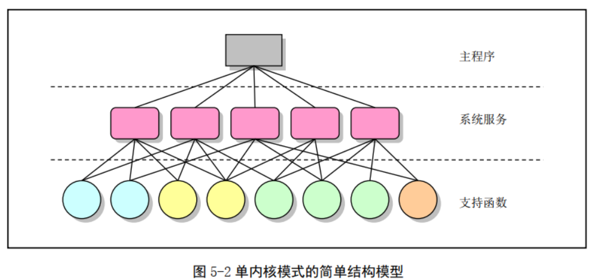

对于微内核结构模式，其主要特点是**系统功能的模块化**和**消息传递。**
系统核心提供一个最基本的硬件抽象管理层和关键系统服务功能。这些关键功能主要进程/线程间通信服务、虚拟内存管理和进程调度等。
操作系统其余功能则以各种模块化的形式在用户空间中运行。因此，微内核结构的优点是系统服务偶合度低，便于系统的改进、扩展和移植。
主要缺点则是在系统运行期间需要通过消息传递方式，在微核心和系统各服务进程模块之间进行大量消息传递和同步操作，而这些操作会造成通信资源耗费和时间上的延迟。

## 5.2 Linux 内核系统体系结构

Linux 内核主要由 5 个模块构成，它们分别是：
1. 进程调度模块、
   * 进程调度模块用来负责控制进程对 CPU 资源的使用。所采取的调度策略是各进程能够公平合理地访问 CPU，同时保证内核能及时地执行硬件操作。
2. 内存管理模块、
   * 内存管理模块用于确保所有进程能够安全地共享机器主内存区，同时，内存管理模块还支持虚拟内存管理方式，使得 Linux 支持进程使用比实际内存空间更多的内存容量。并可以利用文件系统把暂时不用的内存数据块交换到外部存储设备上去，当需要时再交换回来。
3. 文件系统模块、
   * 文件系统模块用于支持对外部设备的驱动和存储。虚拟文件系统模块通过向所有的外部存储设备提供一个通用的文件接口，隐藏了各种硬件设备的不同细节。从而提供并支持与其他操作系统兼容的多种文件系统格式。
4. 进程间通信模块
   * 进程间通信模块子系统用于支持多种进程间的信息交换方式。
5. 网络接口模块
    * 进程间通信模块子系统用于支持多种进程间的信息交换方式。

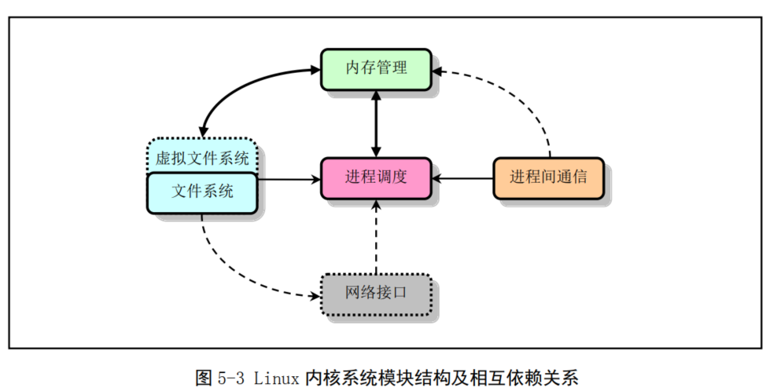

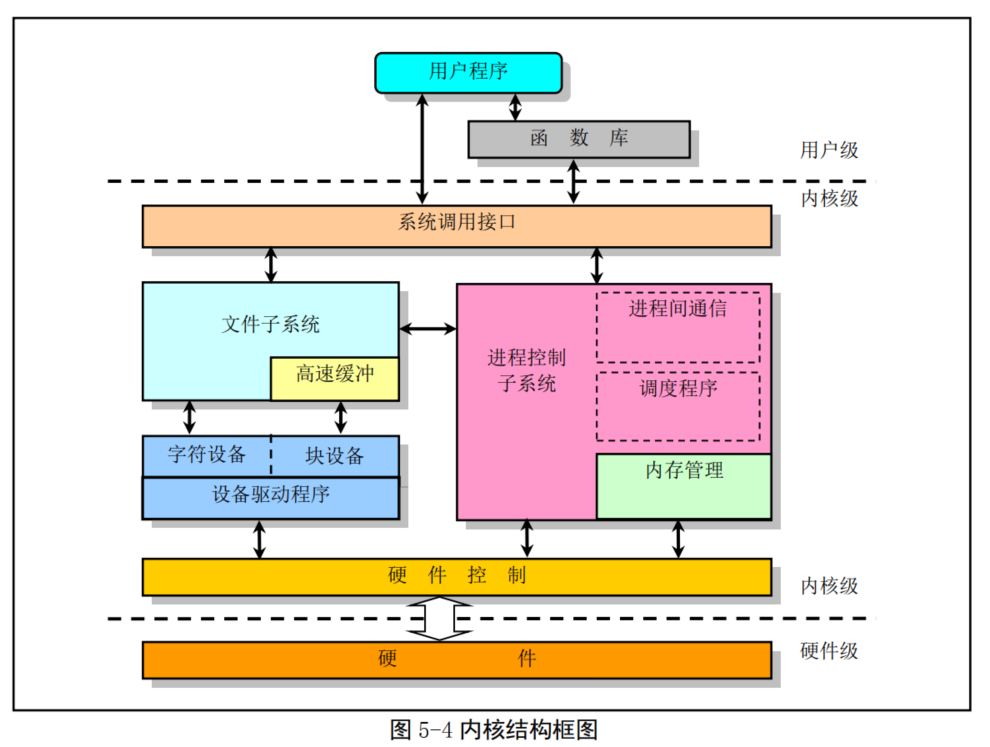

## 5.3 Linux 内核对内存的管理和使用

### 5.3.1物理内存

在 Linux 0.12 内核中，为了有效地使用机器中的物理内存，在系统初始化阶段内存被划分成几个功能区域。

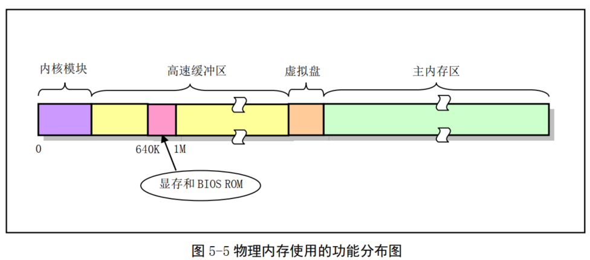

* 其中， Linux 内核程序占据在物理内存的开始部分，
* 接下来是供硬盘或软盘等块设备使用的高速缓冲区部分（其中要扣除显示卡内存和 ROM BIOS 所占用的内存地址范围 640K--1MB）。
  * 当一个进程需要读取块设备中的数据时，系统会首先把数据读到高速缓冲区中；当有数据需要写到块设备上去时，系统也是先将数据放到高速缓冲区中，然后由块设备驱动程序写到相应的设备上。
* 内存的最后部分是供所有程序可以随时申请和使用的主内存区。内核程序在使用主内存区时，也同样首先要向内核内存管理模块提出申请，并在申请成功后方能使用。
* 对于含有 RAM 虚拟盘的系统，主内存区头部还要划去一部分，供虚拟盘存放数据。

在 Intel 80386 及以后的 CPU 中提供了两种内存管理（地址变换）系统：**内存分段系统（ Segmentation System）** 和**分页系统（ Paging System）**。
其中分页管理系统是可选择的，由系统程序员通过编程来确定是否采用。为了能有效地使用物理内存， Linux 系统同时采用了内存分段和分页管理机制

### 5.3.2 内存地址空间概念

* a. 程序（ 进程）的虚拟和逻辑地址；
   * 虚拟地址（ Virtual Address）是指由程序产生的由段选择符和段内偏移地址两个部分组成的地址。因为这两部分组成的地址并没有直接用来访问物理内存，而是需要通过分段地址变换机制处理或映射后才对应到物理内存地址上，因此这种地址被称为虚拟地址。
* b. CPU 的线性地址；
  * 线性地址（ Linear Address） 是虚拟地址到物理地址变换之间的中间层，是处理器可寻址的内存空间 （称为线性地址空间）中的地址。程序代码会产生逻辑地址，或者说是段中的偏移地址，加上相应段的基地址就生成了一个线性地址
* c. 实际物理内存地址。

### 5.3.3 内存分段机制

CPU 进行地址变换（映射）的主要目的是为了解决虚拟内存空间到物理内存空间的映射问题。虚拟内存空间的含义是指一种利用二级或外部存储空间，使程序能不受实际物理内存量限制而使用内存的一种方法。通常虚拟内存空间要比实际物理内存量大得多。

那么虚拟存储管理是怎样实现的呢？原理与上述列车运行的比喻类似。
首先，当一个程序需要使用一块不存在的内存时（也即在内存页表项中已标出相应内存页面不在内存中）， CPU 就需要一种方法来得知这个情况。
这是通过 80386 的页错误异常中断来实现的。当一个进程引用一个不存在页面中的内存地址时，就会触发 CPU 产生页出错异常中断，并把引起中断的线性地址放到 CR2 控制寄存器中。
因此 处理该中断的过程就可以知道发生页异常的确切地址，从而可以把进程要求的页面从二级存储空间（比如硬盘上）加载到物理内存中。
如果此时物理内存已经被全部占用，那么可以借助二级存储空间的一部分作为交换缓冲区（ Swapper） 把内存中暂时不使用的页面交换到二级缓冲区中，然后把要求的页面调入内存中。这也就是内存管理的缺页加载机制，在 Linux 0.12 内核中是在程序 mm/memory.c 中实现

每个程序都可有若干个内存段组成。程序的逻辑地址（或称为虚拟地址）即是用于寻址这些段和段中具体地址位置。
在 Linux 0.12 中，程序逻辑地址到线性地址的变换过程使用了 CPU 的全局段描述符表 GDT 和局部段描述符表 LDT。由 GDT 映射的地址空间称为**全局地址空间**，由 LDT 映射的地址空间则称为**局部地址空间**，而这两者构成了虚拟地址的空间。

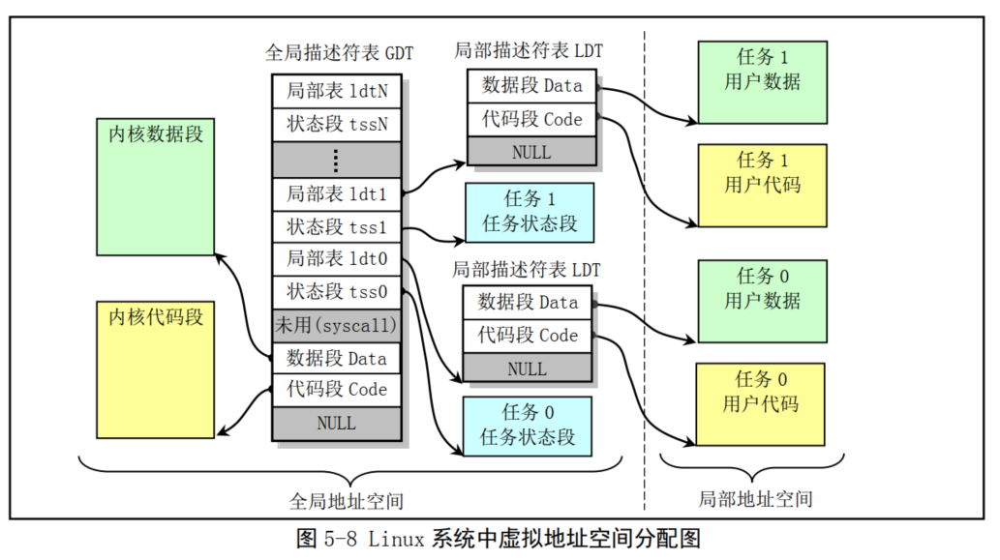

### 5.3.4 内存分页管理

使用分页机制最普遍的场合是当系统内存实际上被分成很多凌乱的块时,它可以建立一个大而连续的内存空间映像，好让程序不用操心和管理这些分散的内存块。
分页机制增强了分段机制的性能。另外，页地址变换建立在段变换基础之上，任何分页机制的保护措施并不会取代段变换的保护措施而只是进行更进一步的检查操作

由于 Linux 0.1x 系统中内核和所有任务都共用同一个页目录表，使得任何时刻处理器线性地址空间到物理地址空间的映射函数都一样。
因此为了让内核和所有任务都不互相重叠和干扰，它们都必须从虚拟地址空间映射到线性地址空间的不同位置，即占用不同的线性地址空间范围。

对于 Linux 0.12 系统，内核设置全局描述符表 GDT 中的段描述符项数最大为 256， 其中 2 项空闲、 2 项系统使用，每个进程使用两项。
因此， 此时系统可以最多容纳(256-4)/2 =126 个任务，并且虚拟地址范围是 ((256-4)/2)* 64MB 约等于 8G。
但 0.12 内核中人工定义最大任务数 NR_TASKS = 64 个，每个任务逻辑地址范围是 64M，并且各个任务在线性地址空间中的起始位置是 (任务号)*64MB。

图中示出了当系统具有 4 个任务时的情况。
内核代码段和数据段被映射到线性地址空间的开始 16MB 部分，并且代码和数据段都映射到同一个区域，完全互相重叠。
而第 1 个任务（任务 0）是由内核“人工”启动运行的，其代码和数据包含在内核代码和数据中，因此该任务所占用的线性地址空间范围比较特殊。
任务 0 的代码段和数据段的长度是从线性地址 0 开始的 640KB 范围，其代码和数据段也完全重叠，并且与内核代码段和数据段有重叠的部分。

**请还需注意，进程逻辑地址空间中代码段（ Code Section） 和数据段（ Data Section）的概念与 CPU分段机制中的代码段和数据段不是同一个概念。** 
CPU 分段机制中段的概念确定了在线性地址空间中一个段的用途以及被执行或访问的约束和限制，每个段可以设置在 4GB 线性地址空间中的任何地方，它们可以相互独立也可以完全重叠或部分重叠。
而进程在其逻辑地址空间中的代码段和数据段则是指由编译器在编译程序和操作系统在加载程序时规定的在进程逻辑空间中顺序排列的代码区域、初始化和未初始化的数据区域以及堆栈区域。
进程逻辑地址空间中代码段和数据段等结构形式见图所示

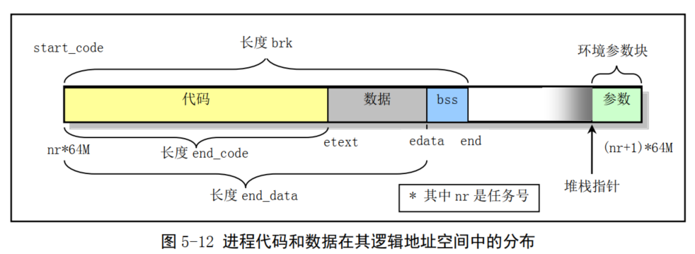

### 5.3.5 CPU多任务和保护模式

当一个任务（ 进程） 执行系统调用而陷入内核代码中执行时，我们就称进程处于内核运行态（或简称为内核态）。 
此时处理器处于特权级最高的（ 0 级）内核代码中执行。当进程处于内核态时，执行的内核代码会使用当前进程的内核栈。每个进程都有自己的内核栈。

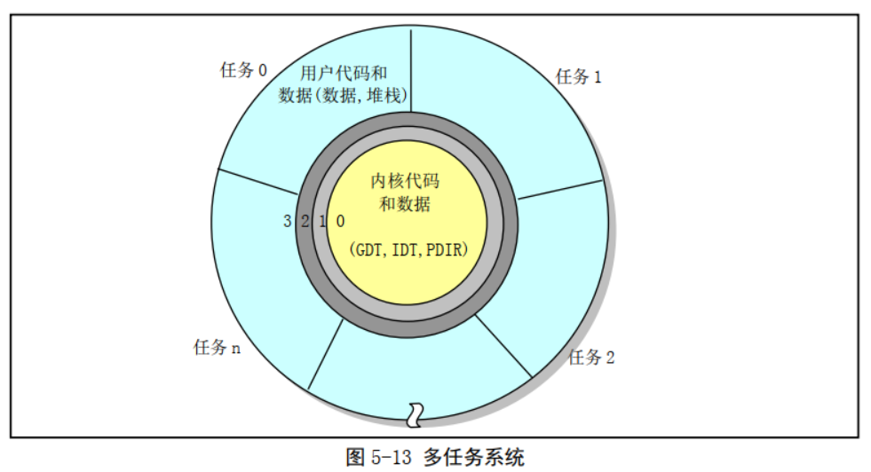

### 5.3.6 虚拟地址、线性地址、物理地址之间的关系

对于 Linux 0.12 内核代码和数据来说，在 head.s 程序的初始化操作中已经把内核代码段和数据段都设置成为长度为 16MB 的段。
在线性地址空间中这两个段的范围重叠，都是从线性地址 0 开始到地址 0xFFFFFF 共 16MB 地址范围。 
在该范围中含有内核所有的代码、内核段表（ GDT、 IDT、 TSS）、页目录表和内核的二级页表、内核局部数据以及内核临时堆栈（将被用作第 1 个任务即任务 0 的用户堆栈）。
其页目录表和二级页表已设置成把 0--16MB 的线性地址空间一一对应到物理地址上，占用了 4 个目录项， 即 4 个二级页表。
因此对于内核代码或数据的地址来说，我们可以直接把它们看作是物理内存中的地址。 此时内核的虚拟地址空间、线性地址空间和物理地址空间三者之间的关系可用图 5-14 来表示。

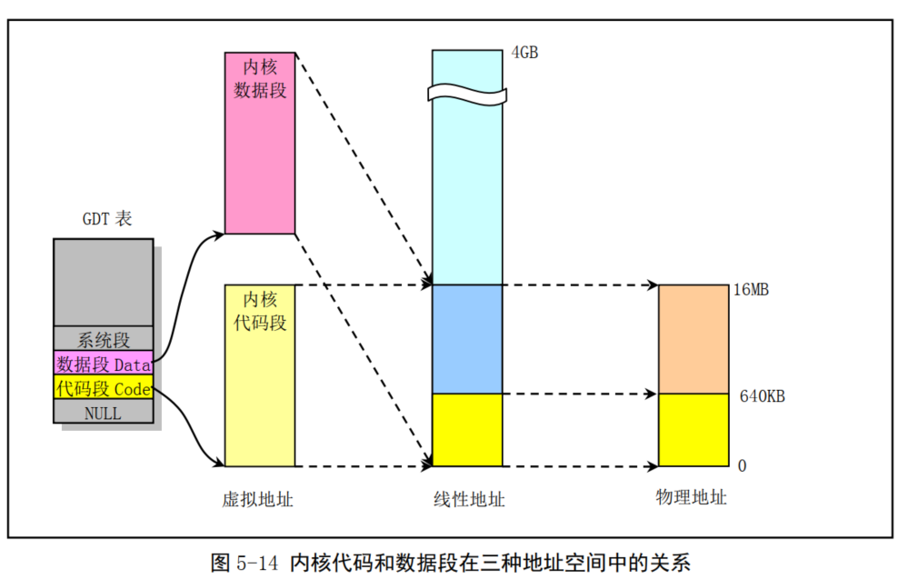

#### **任务 0 的地址对应关系**

任务 0 是系统中一个人工启动的第一个任务。它的代码段和数据段长度被设置为 640KB。该任务的代码和数据直接包含在内核代码和数据中，是从线性地址 0 开始的 640KB 内容，因此可以它直接使用内核代码已经设置好的页目录和页表进行分页地址变换。同样，它的代码和数据段在线性地址空间中也是重叠的。
对应的任务状态段 TSS0 也是手工预设置好的，并且位于任务 0 数据结构信息中，

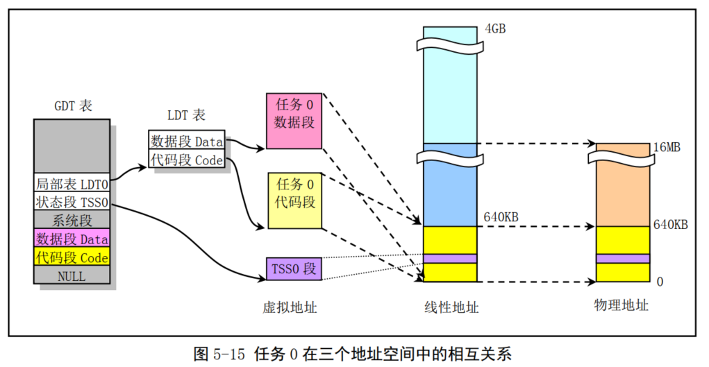

#### 任务 1 的地址对应关系

与任务 0 类似，任务 1 也是一个特殊的任务。它的代码也在内核代码区域中。与任务 0 不同的是在线性地址空间中，系统在使用 fork()创建任务 1（ init 进程）时为存放任务 1 的二级页表而在主内存区申请了一页内存来存放，并复制了父进程（任务 0）的页目录和二级页表项。

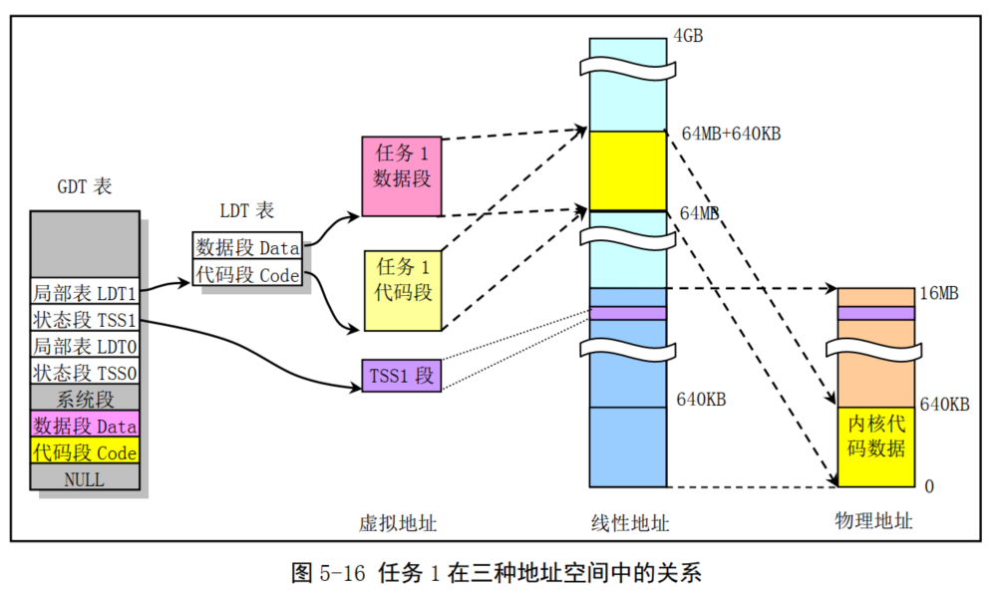

#### 他任务的地址对应关系

对于被创建的从任务 2 开始的其他任务，它们的父进程都是 init（任务 1）进程。

从任务 2 开始，如果任务号以 nr 来表示，那么任务 nr 在线性地址空间中的起始位置将被设定在 nr*64MB 处。

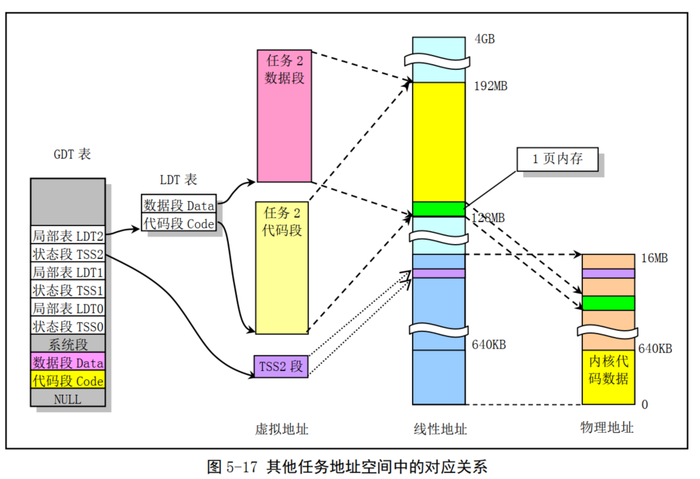

### 5.3.7用户申请内存的动态分配

当用户应用程序使用 C 函数库中的内存分配函数 malloc()申请内存时，这些动态申请的内存容量或大小均由高层次的 C 库函数 malloc()来进行管理，内核本身并不会插手管理。
因为内核已经为每个进程（除了任务 0 和 1，它们与内核代码一起常驻内存中）在 CPU 的 4G 线性地址空间中分配了 64MB 的空间，所以只要进程执行时寻址的范围在它的 64MB 范围内，内核也同样会通过内存缺页管理机制自动为寻址对应的页面分配物理内存页面并进行映射操作。

## 5.4 中断机制

当设备向处理器提出服务请求时，处理器会在执行完当前的一条指令后立刻应答设备的请求，并转而执行该设备的相关服务程序。当服务程序执行完成后，处理器会接着去做刚才被中断的程序。
这种处理方式就叫做中断（ Interrupt）方法，而设备向处理器发出的服务请求则称为中断请求（ IRQ - Interrupt Request）。
处理器响应请求而执行的设备相关程序则被称为中断服务程序或中断服务过程（ ISR - Interrupt Service Routine）。

### 5.4.2 80X86 微机的中断子系统

在使用 80X86 组成的微机系统中采用了 8259A 可编程中断控制器芯片。每个 8259A 芯片可以管理 8 个中断源。通过多片级联方式， 8259A 能构成最多管理 64 个中断向量的系统。

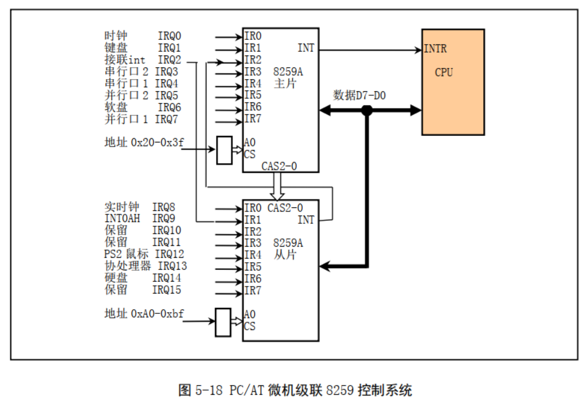

### 5.4.3 中断向量表

80X86 微机支持 256 个中断，对应每个中断需要安排一个中断服务程序。
在 80X86 实模式运行方式下，每个中断向量由 4 个字节组成。这 4 个字节指明了一个中断服务程序的段值和段内偏移值。因此整个向量表的长度为 1024 字节。
当 80X86 微机启动时， ROM BIOS 中的程序会在物理内存开始地址 0x0000:0x0000 处初始化并设置中断向量表，而各中断的默认中断服务程序则在 BIOS 中给出。
由于中断向量表中的向量是按中断号顺序排列，因此给定一个中断号 N，那么它对应的中断向量在内存中的位置就是 0x0000:N*4，即对应的中断服务程序入口地址保存在物理内存 0x0000:N*4 位置处

在 BIOS 执行初始化操作时，它设置了两个 8259A 芯片支持的 16 个硬件中断向量和 BIOS 提供的中断号为 0x10—0x1F 的中断调用功能向量等。
对于实际没有使用的向量则填入临时的哑中断服务程序的地址。以后在系统引导加载操作系统时会根据实际需要修改某些中断向量的值

### 5.4.4 Linux 内核的中断处理

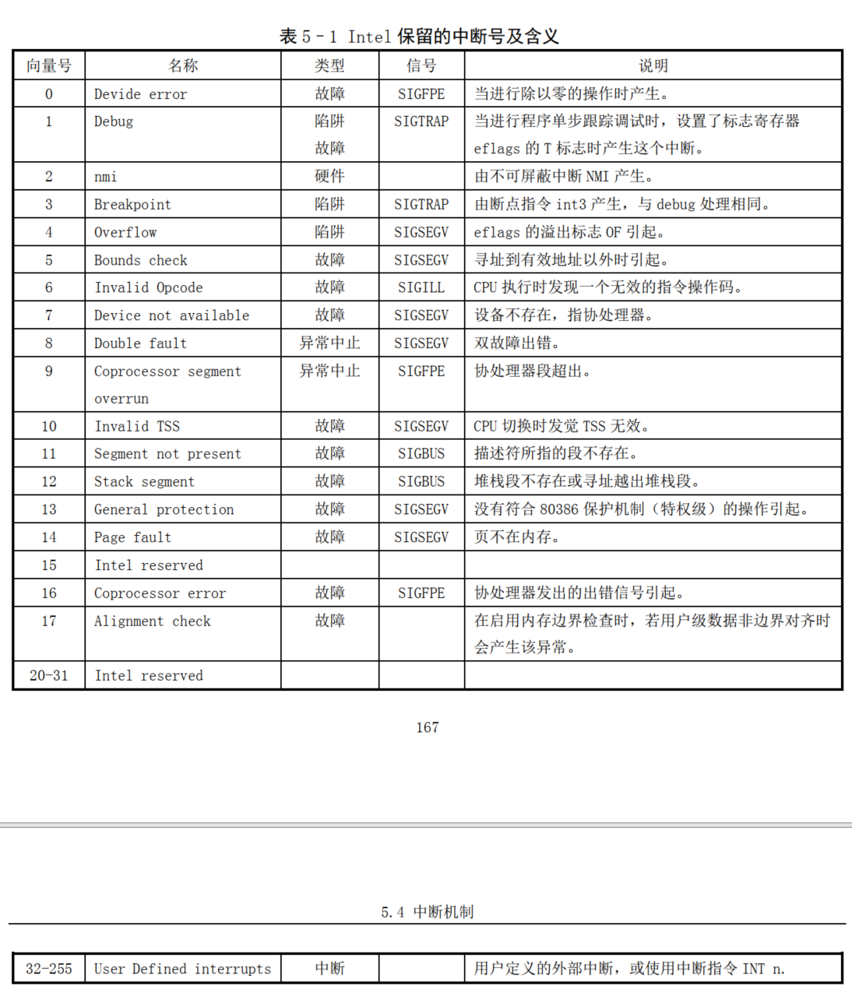

在 Linux 系统中，则将 INT32--INT47（ 0x20--0x2F）对应于 8259A 中断控制芯片发出的硬件中断请求信号 IRQ0--IRQ15（见表 5–3 所示），并把用户程序发出的软件中断设置为 INT128（ 0x80），并称为系统调用（ System Call）。

**系统调用中断是用户程序使用操作系统资源的唯一界面接口**

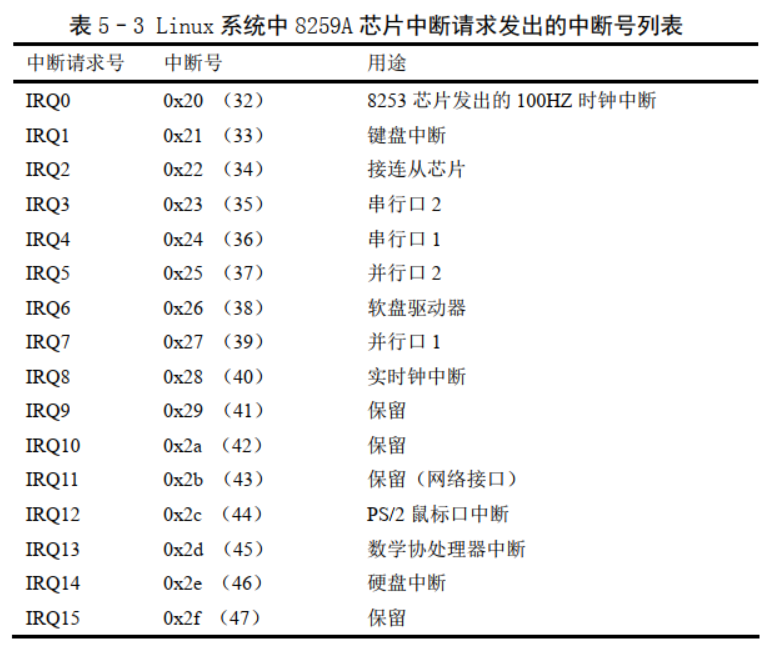

在系统初始化时，内核会首先使用一个哑中断向量（中断描述符）对中断描述符表（ Interrupt Descriptor Table - IDT） 中所有 256 个描述符进行了默认设置。这个哑中断向量指向一个默认的“无中断”处理过程。

在设置中断描述符表 IDT 时 Linux 内核使用了中断门和陷阱门两种描述符。它们之间的区别在于对标志寄存器 EFLAGS 中的中断允许标志 IF 的影响。
* 由中断门描述符执行的中断会复位 IF 标志， 因此可以避免其它中断干扰当前中断的处理，随后的中断结束指令 iret 会从堆栈上恢复 IF 标志的原值；
* 而通过陷阱门执行的中断则不会影响 IF 标志。

### 5.4.5 标志寄存器的中断标志

为了避免竞争条件和中断对临界代码区的干扰，在 Linux 0.12 内核代码中许多地方使用了 `cli` 和 `sti` 指令。 
* cli 指令用来复位 CPU 标志寄存器中的中断标志，使得系统在执行 cli 指令后不会响应外部中断。
* sti 指令用来设置标志寄存器中的中断标志，以允许 CPU 能识别并响应外部设备发出的中断。

## 5.5 Linux 系统调用

### 5.5.1系统调用接口

系统调用（通常称为 syscalls）是 Linux 内核与上层应用程序进行交互通信的唯一接口，

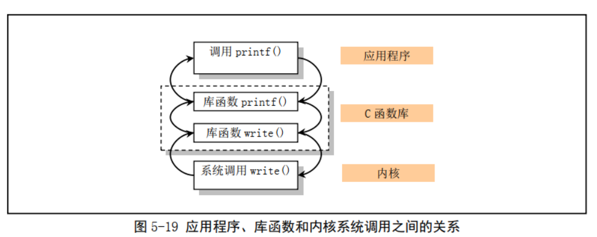

### 5.5.2 系统调用处理过程

当应用程序经过库函数向内核发出一个中断调用 `int 0x80` 时，就开始执行一个系统调用。**其中寄存器 eax 中存放着系统调用号，而携带的参数可依次存放在寄存器 ebx、 ecx 和 edx 中**。
因此 Linux 0.12 内核中用户程序能够向内核最多直接传递三个参数，当然也可以不带参数。处理系统调用中断 int 0x80 的过程是程序 kernel/system_call.s 中的 system_call。

### 5.5.3Linux 系统调用的参数传递方式

* 通用寄存器传递方法， 例如寄存器 ebx、 ecx 和 edx。
  * 这种使用寄存器传递参数方法的一个明显优点就是：当进入系统中断服务 程序而保存寄存器值时，这些传递参数的寄存器也被自动地放在了内核态堆栈上，因此用不着再专门对传递参数的寄存器进行特殊处理。这种方法是 Linus 先生当时所知的最简单最快速的参数传递方法。
* 另 外还有一种使用 Intel CPU 提供的系统调用门（ System Call gate） 的参数传递方法，它在进程用户态堆栈 和内核态堆栈自动复制传递的参数。但这种方法使用起来步骤比较复杂。

## 5.6 系统时间和定时

### 5.6.1 系统时间

为了让操作系统能自动地准确提供当前时间和日期信息， PC/AT 微机系统中提供了用电池供电的实时钟 RT（ Real Time）电路支持。通常这部分电路与保存系统信息的少量 CMOS RAM 集成在一个芯片上，因此这部分电路被称为 RT/CMOS RAM 电路

### 5.6.2 系统定时

统的基本定时节拍由定时芯片产生。 在 Linux 0.12 内核的初始化过程中， PC 机的可编程定时芯片 Intel 8253（ 8254）的计数器通道 0 被设置成运行在方式 3 下（方波发生器方式），并且初始计数值 LATCH 
被设置成每隔 10 毫秒在通道 0 输出端 OUT 发出一个方波上升沿。由于 8254 芯片的时钟输入频率为 1.193180MHz，因此初始计数值 LATCH=1193180/100，约为 11931。
由于 OUT 引脚被连接到可编程中断 控制芯片的 0 级上，因此系统每隔 10 毫秒就会发出一个时钟中断请求（ IRQ0）信号。
这个时间节拍就是操作系统运行的脉搏，我们称之为 1 个系统滴答或一个系统时钟周期。因此每经过 1 个滴答时间，系统就会调用一次时钟中断处理程序（ timer_interrupt）。

## 5.7 Linux 进程控制

程序是一个可执行的文件，而进程（ process）是一个执行中的程序实例。利用分时技术，在 Linux 操作系统上同时可以运行多个进程。
分时技术的基本原理是把 CPU 的运行时间划分成一个个规定长度的时间片(time slice)，让每个进程在一个时间片内运行。当进程的时间片用完时系统就利用调度程序切换到另一个进程去运行。
因此实际上对于具有单个 CPU 的机器来说某一时刻只能运行一个进程。但由于每个进程运行的时间片很短（例如 15 个系统滴答=150 毫秒），所以表面看来好象所有进程在同时运行着

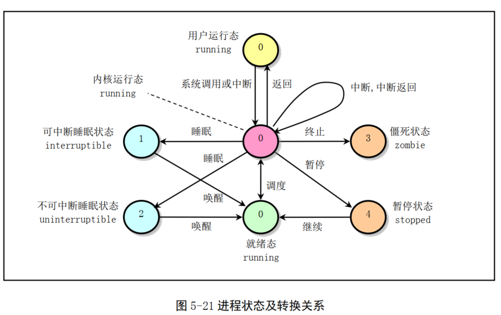

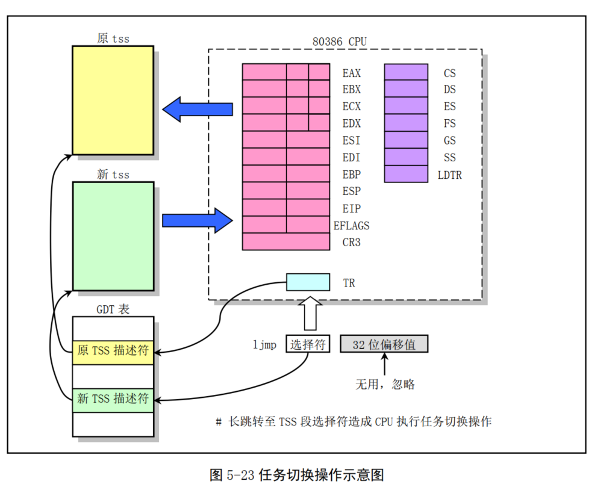

## 5.8 Linux 系统中堆栈的使用方法

Linux 0.12 系统中共使用了四种堆栈。
* 一种是系统引导初始化时临时使用的堆栈；
* 一种是进入保护模式之后提供内核程序初始化使用的堆栈，位于内核代码地址空间固定位置处。该堆栈也是后来任务 0 使用的用户态堆栈；
* 另一种是每个任务通过系统调用，执行内核程序时使用的堆栈，我们称之为任务的内核态堆栈。每个任务都有自己独立的内核态堆栈；
* 最后一种是任务在用户态执行的堆栈，位于任务（进程）逻辑地址空间近末端处。

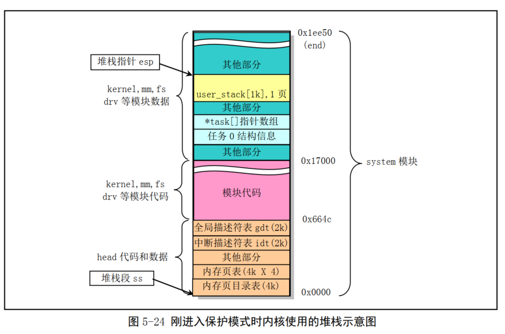

