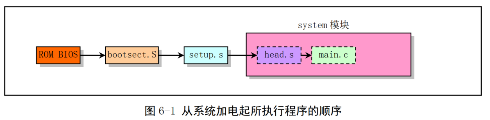
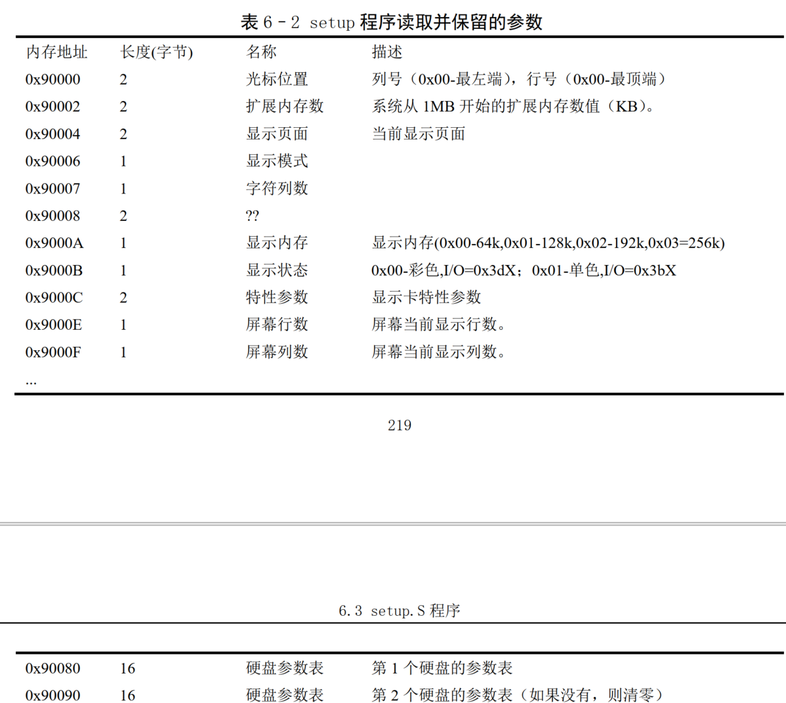

bootsect.S分析一文中有这样一段代码： 

seg fs 
lds si,(bx)  ! ds:si是源地址; !! 将fs:bx地址所指的指针值放入ds:si中; 

先讲一下寄存器的默认组合问题，比如指令mov [si], ax表示将ax中的内容存入ds:si指向的内存单元，
也就是说在寄存器间接寻址的情况下,**以si间接寻址时总是默认以ds为相应的段地址寄存器。同样di是以es为默认的段地址寄存器。** 

第二个要了解的是“段超越”的问题，就是在某些时候你不想使用默认的段地址寄存器，那 么你可以强制指定一个段地址寄存器（当然这种强制是在允许的情况下，建议看一下汇编 教材上的说明），同上例mov [si],ax表示存入ds:si中，但如果你想存入cs指向的段中可 以这样mov cs:[si],ax， 这样就强制指定将ax中的内容存入cs:si的内存单元。 

第三个要明白的是seg cs这样的语句只影响到它下一条指令，比如在linux启动代码中的一段： 

   
seg cs
mov sectors,ax 
mov ax,#INITSEG

要说明两点： 
第一，seg cs 只影响到mov sectors,ax而不影响mov ax,#INITSEG 第二，如果以Masm语法写，seg cs和mov sectors,ax两句合起来等价于mov cs:[sectors],ax，这里使用了间接寻址方式。       
重复一下前面的解释，mov [sectors],ax表示将ax中的内容存入ds:sectors内存单元，而mov cs:[sectors],ax强制以cs作为段地址寄存器，因此是将ax的内容存入cs:sectors内存单元，
一般来说cs与ds的值是不同的，如果cs和ds的值一样，那两条指令的运行结果会是一样的。（编译后的指令后者比前者一般长一个字节，多了一个前缀。） 

结论，seg cs只是表明紧跟它的下一条语句将使用段超越，因为在编译后的代码中可以清楚的看出段超越本质上就是加了一个字节的指令前缀，因此as86把它单独作为一条指令来写也是合理的。 

note：seg指令只会影响数据寄存器（目前知道的有bx）的段地址信息，不会影响索引寄存器（si和di）的段地址信息，索引寄存器在计算地址时仍使用数据段（ds）为段寄存器

instruction     jump condition              description

JMP                                         跳转（Jump）
JA/JNBE         (CF or ZF) = 0              无符号条件跳转，大于则跳转/不小于等于时跳转（Jump if above/Jump if not below or equal）
JAE/JNB         CF = 0                      无符号条件跳转，大于等于则跳转/不小于时跳转（Jump if above or equal/Jump if not below）
JB/JNAE         CF = 1                      无符号条件跳转，小于则跳转/不大于等于时跳转（Jump if below/Jump if not above or equal）
JBE/JNA         (CF or ZF) = 1              无符号条件跳转，小于等于时跳转/不大于时跳转（Jump if below or equal/Jump if not above）
JC              CF = 1                      无符号条件跳转，如果进位则跳转（Jump if carry）
JE/JZ           ZF = 1                      无符号条件跳转，相等则跳转/为零则跳转（Jump if equal/Jump if zero）
JNC             CF = 0                      无符号条件跳转，如果没进位则跳转（Jump if not carry）
JNE/JNZ         ZF = 0                      无符号条件跳转，不等则跳转/不为零则跳转（Jump if not equal/Jump if not zero）
JPO/JNP         PF = 0                      无符号条件跳转，如果二进制表示中1的个数为奇数则跳转（Jump if parity odd/Jump if not parity）
JPE/JP          PF = 1                      无符号条件跳转，如果二进制表示中1的个数为偶数则跳转（Jump if parity even/Jump if parity）
JCXZ            CX = 0                      无符号条件跳转，寄存器CX为0时跳转（Jump register CX zero）（注，寄存器CX一般作为计数器使用，例如用于循环）
JECXZ           ECX = 0                     无符号条件跳转，寄存器ECX为0时跳转（Jump register ECX zero）（同上）

JG/JNLE         ((SF xor OF) or ZF) = 0     有符号条件跳转，大于则跳转/不小于则跳转（Jump if greater/Jump if not less or equal）
JGE/JNL         (SF xor OF) = 0             有符号条件跳转，大于等于则跳转/不小于则跳转（Jump if greater or equal/Jump if not less）
JL/JNGE         (SF xor OF) = 1             有符号条件跳转，小于则跳转/不大于则跳转（Jump if less/Jump if not greater or equal）
JLE/JNG         ((SF xor OF) or ZF) = 1     有符号条件跳转，小于等于则跳转/不大于则跳转（Jump if less or equal/Jump if not greater）
JO              OF = 1                      有符号条件跳转，如果溢出则跳转（Jump if overflow）
JNO             OF = 0                      有符号条件跳转，如果没溢出则跳转（Jump if not overflow）
JS              SF = 1                      有符号条件跳转，如果是负数则跳转（Jump if sign (negative)）
JNS             SF = 0                      有符号条件跳转，如果是非负数则跳转（Jump if not sign (non-negative)）

LOOP            ECX != 0                    ECX不为0时循环（Loop with ECX counter）
LOOPZ/LOOPE     ECX != 0 and ZF = 1         ECX不为零且标志Z=1时循环（Loop with ECX and zero/Loop with ECX and equal）
LOOPNZ/LOOPNE   ECX != 0 and ZF = 0         ECX不为零且标志Z=0时循环（Loop with ECX and not zero/Loop with ECX and not equal）

CALL                                        调用过程（Call procedure）
RET                                         函数返回（Return）
IRET                                        从中断返回（Return from interrupt）
INT                                         软中断（Software interrupt）
INTO                                        （Interrupt on overflow）
BOUND                                       检查是否越界（Detect value out of range）
ENTER                                       （High-level procedure entry）
LEAVE                                       （High-level procedure exit）

**bootsect 的代码为什么不把系统模块直接加载到物理地址 0x0000 开始处而要在 setup 程序中再进行移动呢？**

这是因为随后执行的 setup 开始部分的代码还需要利用 ROM BIOS 提供的中断调用功能来获取有关机器配置的一些参数（例如显示卡模式、硬盘参数表等）。 
而当 BIOS 初始化时会在物理内存开始处放置一个大小为 0x400 字节(1KB)的中断向量表， 直接把系统模块放在物理内存开始处将导致该中断向量表被覆盖掉。 
因此引导程序需要在使用完 BIOS 的中断调用后才能将这个区域覆盖掉

Linux 系统中基本设备的主设备号有：
* 1 - 内存；
* 2 - 磁盘；
* 3 - 硬盘；
* 4 - ttyx；
* 5 - tty；
* 6 - 并行口；
* 7 - 非命名管道。

1 个硬盘中可以有 1--4 个分区，因此硬盘还使用次设备号来指定分区

设备号 = 主设备号*256 + 次设备号

setup.S 是一个操作系统加载程序，它的主要作用是
1. 利用 ROM BIOS 中断读取机器系统数据，并将这些数据保存到 0x90000 开始的位置（覆盖掉了 bootsect 程序所在的地方）。
2. 然后 setup 程序将 system 模块从 0x10000-0x8ffff 整块向下移动到内存绝对地址 0x00000 处（当时认为内核系统模块 system 的长度不会超过此值： 512KB）。
3. 接下来加载中断描述符表寄存器(IDTR)和全局描述符表寄存器(GDTR)，开启 A20 地址线，重新设置两个中断控制芯片 8259A，将硬件中断号重新设置为 0x20 - 0x2f。
4. 最后设置 CPU 的控制寄存器 CR0（也称机器状态字），进入 32 位保护模式运行，并跳转到位于 system 模块最前面部分的 head.s 程序继续运行。

