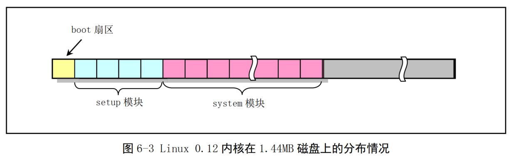

**bootsect 的代码为什么不把系统模块直接加载到物理地址 0x0000 开始处而要在 setup 程序中再进行移动呢？**

这是因为随后执行的 setup 开始部分的代码还需要利用 ROM BIOS 提供的中断调用功能来获取有关机器配置的一些参数（例如显示卡模式、硬盘参数表等）。 
而当 BIOS 初始化时会在物理内存开始处放置一个大小为 0x400 字节(1KB)的中断向量表， 直接把系统模块放在物理内存开始处将导致该中断向量表被覆盖掉。 
因此引导程序需要在使用完 BIOS 的中断调用后才能将这个区域覆盖掉

